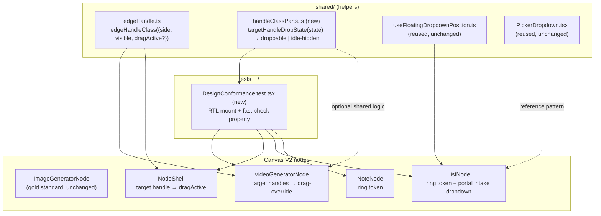

# Design Document

## Overview

This is a surgical conformance cleanup of four Canvas V2 deviation classes plus a regression
test layer, scoped exactly as defined in `requirements.md`. No routing, validation, or
persistence logic changes (R7.7). The work touches five production files, extends one shared
helper, adds one tiny pure module, and adds one test config line.

The guiding principle from `.agents/rules/canvas-v2-design-rules.md` §5 and the gold standards
(`ImageGeneratorNode.tsx`, `VariantNode.tsx`) is: **every target handle must force
`!opacity-100 !pointer-events-auto !z-50` while `useConnection().inProgress` is true**, so
ReactFlow collision detection accepts the drop. Today `ImageGeneratorNode` does this
(`targetHandleClassName`, lines 100–115) but `VideoGeneratorNode` and `NodeShell` do not.

### Files that change and why

| File | Change | Requirement | Size |
|------|--------|-------------|------|
| `frontend/src/canvas/v2/shared/edgeHandle.ts` | Add an opt-in `dragActive` flag to `edgeHandleClass(...)` that appends `!pointer-events-auto !z-50` and forces visibility. Offsets and existing call behavior unchanged. | R2.3, R2.5 | +~8 lines |
| `frontend/src/canvas/v2/VideoGeneratorNode.tsx` | Make the four **target** handles force the drag-override during `connection.inProgress`, mirroring `ImageGeneratorNode`. Source handles untouched. | R1.1–R1.4 | ~6 lines |
| `frontend/src/canvas/v2/NodeShell.tsx` | Pass `dragActive: connection.inProgress` to `edgeHandleClass` for the target handle only. Source handle untouched. | R2.1, R2.2, R2.4, R2.6 | ~2 lines |
| `frontend/src/canvas/v2/ListNode.tsx` | (a) Selected-ring token swap `ring-1 ring-accent/30` → `ring-2 ring-accent/50`; (b) replace the inline intake dropdown + manual `document` `mousedown` listener with a `createPortal`-based floating dropdown reusing `useFloatingDropdownPosition`. | R3.1–R3.4, R5.1–R5.6 | ~40 lines net |
| `frontend/src/canvas/v2/NoteNode.tsx` | Selected-ring token swap `ring-2 ring-accent/60` → `ring-2 ring-accent/50`. | R4.1–R4.3 | 1 line |
| `frontend/src/canvas/v2/shared/handleClassParts.ts` (new) | Tiny pure helper `targetHandleDropState(...)` used by the §5 PBT property and (optionally) the nodes, so the "for all states" invariant is deterministically testable. | R6.5 | new, ~25 lines |
| `frontend/vite.config.ts` | Vitest already runs `// @vitest-environment jsdom` per-file docblocks; no behavioral change is strictly required, but we document/standardize the jsdom opt-in. | R8.3 | 0–3 lines |
| `frontend/src/canvas/v2/__tests__/DesignConformance.test.tsx` (new) | The Conformance_Test_Suite. | R6.1–R6.8 | new |

### Out of scope (confirmed against R7)

No change to `Board.tsx`, `store/board.ts`, edge DTOs, `PickerDropdown` panel styling
(`#1f232b`/`rounded-[20px]`), `GroupNodeShell`, the `VariantNode` grid, the ListNode tile grid,
the NoteNode pastel background/border/handle-less layout, or `EXTERNAL_HEADER_EDGE_HANDLE_TOP_OFFSET=72`.
The gold-standard nodes are not modified (R7.1).

## Architecture

The fix preserves the established ownership boundary from the design rules: node components own
visual presentation and handle hit-target visibility; `Board.tsx` / `store/board.ts` own
validation, body-drop routing, and persistence. All changes here live entirely in the
presentation layer.



### §5 visibility model (the core invariant)

For any target handle, three boolean facts decide its drop state:

- `inProgress` — `useConnection().inProgress` (a global active gesture)
- `visibleByState` — `hovered || selected || hasTargetEdge` (the idle reveal conditions)

Resulting class set:

| `inProgress` | `visibleByState` | Applied classes |
|:---:|:---:|---|
| true | (any) | `!opacity-100 !pointer-events-auto !z-50` (**drag-override, highest precedence**) |
| false | true | `!opacity-100` |
| false | false | `!opacity-0 !pointer-events-none` (idle-hidden) |

The drag-override row must win over the idle-hidden row (R2.6). This is exactly what
`ImageGeneratorNode.targetHandleClassName` produces today and what we propagate.

## Components and Interfaces

### 1. `edgeHandle.ts` helper extension (R2.3, R2.5)

Current signature (lines 6–19) takes `{ side, visible }`. We add an **optional** `dragActive`
flag. When omitted/false, output is byte-for-byte identical to today (backward compatible — every
existing call site keeps its behavior). When true, it forces visibility and appends the §5
pointer/z-index overrides.

Before:

```ts
export const EDGE_HANDLE_TOP_OFFSET = 48;
export const EXTERNAL_HEADER_EDGE_HANDLE_TOP_OFFSET = 72;

export function edgeHandleClass({
  side,
  visible,
}: {
  side: "left" | "right";
  visible: boolean;
}) {
  return cn(
    "!absolute !h-7 !w-7 !border-0 !bg-transparent group/handle",
    side === "right" ? "!-right-0" : "!-left-0",
    "transition-opacity duration-300 ease-out",
    visible ? "!opacity-100" : "!opacity-0 !pointer-events-none",
  );
}
```

After:

```ts
export const EDGE_HANDLE_TOP_OFFSET = 48;                  // R2.5 — unchanged
export const EXTERNAL_HEADER_EDGE_HANDLE_TOP_OFFSET = 72;  // R2.5 / R7.6 — unchanged

export function edgeHandleClass({
  side,
  visible,
  /**
   * Design Rules §5: when an Active_Connection is in progress, target handles
   * must force `!opacity-100 !pointer-events-auto !z-50` so ReactFlow collision
   * detection accepts the drop. Opt-in and defaults to false, so existing
   * callers (e.g. source handles) are unaffected.
   */
  dragActive = false,
}: {
  side: "left" | "right";
  visible: boolean;
  dragActive?: boolean;
}) {
  const showByState = visible || dragActive;
  return cn(
    "!absolute !h-7 !w-7 !border-0 !bg-transparent group/handle",
    side === "right" ? "!-right-0" : "!-left-0",
    "transition-opacity duration-300 ease-out",
    showByState ? "!opacity-100" : "!opacity-0 !pointer-events-none",
    // Drag-override wins over idle-hidden (R2.6). Placed last so cn() ordering
    // keeps these tokens present whenever a gesture is active.
    dragActive && "!pointer-events-auto !z-50",
  );
}
```

Notes:
- `dragActive` forces `showByState` true, guaranteeing `!opacity-100` and never the idle-hidden
  tokens — satisfying the R2.6 precedence requirement structurally (the idle branch can't be
  reached when `dragActive` is true).
- Constants are exported with identical values (R2.5). No call site that omits `dragActive`
  changes output.

### 2. VideoGeneratorNode target-handle class construction (R1.1–R1.4)

Today (line 296–298) `handleClass` ignores connection state entirely:

```ts
function handleClass(role: "source" | "target", active: boolean) {
  return edgeHandleClass({ side: role === "source" ? "right" : "left", visible: active });
}
```

`handleVisible("target", id)` already returns `showControls || hasEdge || connection.inProgress`
(lines 300–308), so during a drag the handle becomes `!opacity-100` — **but never gets
`!pointer-events-auto !z-50`**, which is the actual §5 defect: collision detection can still
reject the drop.

Change `handleClass` to thread the drag-override for **target** handles only:

```ts
const anyConnectionInProgress = connection.inProgress;

function handleClass(role: "source" | "target", active: boolean) {
  return edgeHandleClass({
    side: role === "source" ? "right" : "left",
    visible: active,
    // Source handles keep their current behavior (R1.4): dragActive stays false.
    dragActive: role === "target" && anyConnectionInProgress,
  });
}
```

The four target Handle JSX declarations (lines 783–816) stay exactly as-is — they already call
`handleClass("target", handleVisible("target", id))`. Because `handleVisible` for targets returns
`true` while `inProgress`, and `handleClass` now appends `!pointer-events-auto !z-50` for targets
during a gesture, all four (`target-text`, `target-start-image`, `target-end-image`,
`target-references`) get the full Drag_Override_Classes (R1.1). When idle and not
hovered/selected/connected, `handleVisible` returns false and the handle is
`!opacity-0 !pointer-events-none` (R1.2). The node already calls `useConnection()` (line ~159)
and treats `connection.inProgress` globally (R1.3). Source handles pass `dragActive: false`, so
their visibility stays tied to hover/selection/edge/`isConnectingFromThisNode` (R1.4).

> Alternative considered: mirror `ImageGeneratorNode` literally by adding a
> `targetHandleClassName(active)` arrow and `&& "!pointer-events-auto !z-50"` inline. We prefer
> routing through the extended `edgeHandle` helper so VideoGeneratorNode and NodeShell share one
> source of truth, but either produces the identical class string. The helper route is also what
> the conformance test asserts against.

### 3. NodeShell target-handle change via the helper (R2.1, R2.2, R2.4, R2.6)

NodeShell already computes `showTargetHandle = showControls || hasTargetEdge || connection.inProgress`
(line ~99) and `showSourceHandle` (line ~92). The only change is the target Handle's `className`
(line ~186): opt into `dragActive`.

Before:

```tsx
className={edgeHandleClass({ side: "left", visible: showTargetHandle })}
```

After:

```tsx
className={edgeHandleClass({
  side: "left",
  visible: showTargetHandle,
  dragActive: connection.inProgress, // R2.1, R2.6
})}
```

The source Handle (line ~170) is left unchanged (R2.4):
`edgeHandleClass({ side: "right", visible: showSourceHandle })`. When idle and not
hovered/selected/connected, `showTargetHandle` is false and `dragActive` is false →
`!opacity-0 !pointer-events-none` (R2.2). The `EDGE_HANDLE_TOP_OFFSET` import and usage are
unchanged (R2.5).

### 4. ListNode + NoteNode selected-ring token change (R3.1–R3.4, R4.1–R4.3)

**ListNode** (line ~548). The card uses a combined selected/connecting border:

```tsx
selected || isConnectingFrom
  ? "border-accent ring-1 ring-accent/30"
  : "border-white/[0.14] hover:border-white/[0.22]",
```

The `ring-1 ring-accent/30` token is non-conformant. Swap the ring tokens only, preserving the
`border-accent` connecting/selected affordance:

```tsx
selected || isConnectingFrom
  ? "border-accent ring-2 ring-accent/50"   // R3.1, R3.2
  : "border-white/[0.14] hover:border-white/[0.22]",
```

`BORDER_RADIUS = 16`, `backgroundColor: "#1a1a1a"`, and `border-[3px]` are untouched (R3.3); hover
and connecting affordances otherwise unchanged (R3.4).

> Note on `isConnectingFrom`: it currently shares the ring with `selected`. R3.1 mandates the
> Selected_Ring while selected; applying the same conformant `ring-2 ring-accent/50` to the
> connecting state keeps existing behavior (R3.4) without introducing a new token. The test for
> R3.3/R6.3 asserts the **selected** state, which this satisfies.

**NoteNode** (line ~738):

```tsx
selected && "ring-2 ring-accent/60",   // before
selected && "ring-2 ring-accent/50",   // after — R4.1, R4.2
```

Pastel background, border color, and handle-less sticky-note layout are untouched (R4.3, R7.2).

### 5. ListNode intake dropdown → shared portal pattern (R5.1–R5.6)

**Reuse decision.** `PickerDropdown` renders single-line `label` + optional `hint` items and calls
`onPick(key)` — a clean fit for the two intake options, *except* it does not change the trigger
label and its items are simpler than the current two-line "title + description" layout. Two viable
routes:

- **Route A (recommended): reuse `PickerDropdown` directly.** Map the two modes to `PickerItem`s
  with `label` + `hint`, drive it with `anchorRef`/`isOpen`/`onClose`/`onPick`. This deletes the
  most bespoke code (manual listener, inline markup, `dropdownRef`) and inherits the portal, rAF
  position tracking, outside-click, Escape, and `nowheel` for free. The only cosmetic delta is the
  panel uses `PickerDropdown`'s `#1f232b`/`rounded-[20px]` styling instead of the old `#1e1e1e`
  popover — explicitly acceptable under R7.5 (PickerDropdown styling is the documented standard and
  out of scope to change).
- **Route B: `useFloatingDropdownPosition` + `createPortal` inline.** Keeps the exact two-line
  visual but re-implements the portal/listener wiring inline. More code, more surface to drift.

**We recommend Route A** as lowest-friction and most rule-conformant (§11). It satisfies R5.1
(portal to `document.body`), R5.2 (rAF `getBoundingClientRect` tracking via
`useFloatingDropdownPosition`), R5.3 (outside pointer closes — `PickerDropdown`'s
`mousedown` capture listener), R5.4 (`nowheel` + `z-[9999]` already on the portal container), and
R5.6 (removes the bespoke inline markup + manual `document` `mousedown` listener).

Before (lines ~174, ~191–203, ~906–945):

```tsx
const dropdownRef = useRef<HTMLDivElement>(null);
const [showIntakeDropdown, setShowIntakeDropdown] = useState(false);

useEffect(() => {
  function handleOutsideClick(event: MouseEvent) {
    if (dropdownRef.current && !dropdownRef.current.contains(event.target as Node)) {
      setShowIntakeDropdown(false);
    }
  }
  if (showIntakeDropdown) document.addEventListener("mousedown", handleOutsideClick);
  return () => document.removeEventListener("mousedown", handleOutsideClick);
}, [showIntakeDropdown]);

// ...trigger + inline popover...
<div className="relative" ref={dropdownRef}>
  <button onClick={() => setShowIntakeDropdown(!showIntakeDropdown)} ...>
    {listIntakeMode === "replace" ? "Replace Items" : "Keep Items"}
    <ChevronDown size={11} className="text-white/40" />
  </button>
  {showIntakeDropdown && (
    <div className="absolute bottom-9 left-0 w-64 ... z-[9999]" style={{ backgroundColor: "#1e1e1e" }}>
      <button onClick={(e) => setIntakeMode("keep", e)} ...>Keep Items …</button>
      <button onClick={(e) => setIntakeMode("replace", e)} ...>Replace Items …</button>
    </div>
  )}
</div>
```

After (Route A):

```tsx
const intakeButtonRef = useRef<HTMLButtonElement>(null);
const [showIntakeDropdown, setShowIntakeDropdown] = useState(false);
// dropdownRef + the manual document mousedown useEffect are DELETED (R5.6).

const INTAKE_ITEMS = [
  { key: "keep",    label: "Keep Items",    hint: "New items will be added" },
  { key: "replace", label: "Replace Items", hint: "New items will replace existing" },
];

// setIntakeMode keeps its existing store update + persist; the (e) arg becomes
// optional since PickerDropdown.onPick passes only the key.
const setIntakeMode = useCallback((mode: "keep" | "replace") => {
  useBoardStore.getState().updateNodeData(rfId, { listIntakeMode: mode });
  persistNodeData(rfId, { listIntakeMode: mode });   // R5.5 persistence preserved
  setShowIntakeDropdown(false);                      // R5.5 close on pick
}, [rfId]);

// ...trigger + portal...
<div className="relative">
  <button
    ref={intakeButtonRef}
    onClick={() => setShowIntakeDropdown((v) => !v)}
    className="flex h-[26px] items-center gap-1 rounded-full bg-white/[0.06] border border-white/[0.08] px-2.5 text-2xs font-semibold text-white/80 hover:text-white hover:bg-white/[0.12] transition-colors cursor-pointer select-none"
  >
    {listIntakeMode === "replace" ? "Replace Items" : "Keep Items"}
    <ChevronDown size={11} className="text-white/40" />
  </button>
  <PickerDropdown
    anchorRef={intakeButtonRef}
    isOpen={showIntakeDropdown}
    onClose={() => setShowIntakeDropdown(false)}
    items={INTAKE_ITEMS}
    activeKey={listIntakeMode}
    onPick={(key) => setIntakeMode(key as "keep" | "replace")}
    minWidth={240}
    estimatedHeight={120}
    matchAnchorWidth={false}
  />
</div>
```

Behavior preserved: `listIntakeMode` defaults to `"replace"`, keep/replace selection updates the
store and persists via `persistNodeData` exactly as before (R5.5). The `ChevronDown` import stays;
unused `dropdownRef` is removed. `PickerDropdown` already renders into `document.body` via
`createPortal` (R5.1), tracks the trigger with a rAF `getBoundingClientRect` loop through
`useFloatingDropdownPosition` (R5.2), closes on outside `mousedown` and Escape (R5.3), and applies
`nowheel` + `z-[9999]` (R5.4).

## Data Models

This feature introduces no new persisted data and no DTO changes. Two small in-memory shapes
support the implementation and tests.

`HandleDropState` — the pure input to the §5 class decision (new `handleClassParts.ts`):

```ts
export interface HandleDropState {
  inProgress: boolean;   // useConnection().inProgress
  hovered: boolean;
  selected: boolean;
  hasEdge: boolean;      // this specific target handle has a connected edge
}

export type HandleDropDecision = "droppable" | "idle-hidden" | "visible-idle";

// droppable      → !opacity-100 !pointer-events-auto !z-50
// visible-idle   → !opacity-100
// idle-hidden    → !opacity-0 !pointer-events-none
export function targetHandleDropState(s: HandleDropState): HandleDropDecision {
  if (s.inProgress) return "droppable";
  if (s.hovered || s.selected || s.hasEdge) return "visible-idle";
  return "idle-hidden";
}
```

`PickerItem` (existing, reused unchanged) for the intake dropdown:
`{ key: string; label: string; hint?: string }`.

`listIntakeMode` (existing node data field): `"keep" | "replace"`, default `"replace"`. Unchanged
persistence contract.

## Correctness Properties

*A property is a characteristic or behavior that should hold true across all valid executions of
a system — essentially, a formal statement about what the system should do. Properties serve as
the bridge between human-readable specifications and machine-verifiable correctness guarantees.*

The prework consolidated R1.1, R1.2, R2.1, R2.2, R2.6, and R6.5 into a single universal
invariant: the §5 **target-handle drop-state truth table**. Every target handle's CSS decision is
a pure function of `(side, inProgress, hovered, selected, hasEdge)`. This is the only genuine
"for all inputs" invariant in the feature; the remaining acceptance criteria are example, edge,
or smoke tests (specific tokens, structural DOM placement, config, and preservation checks) and
are covered in the Testing Strategy below.

Because ReactFlow's live gesture state is difficult to enumerate inside jsdom, the property is
asserted against the **pure class-builder** (`edgeHandleClass({ dragActive })` and the
`targetHandleDropState` helper), which is exactly the code the real nodes call. Real-component RTL
mounts (R6.1–R6.4) provide the complementary integration evidence.

### Property 1: Target-handle drop-state invariant

*For all* target handles and *for all* combinations of `(side ∈ {left, right}, inProgress,
hovered, selected, hasEdge)`:

- WHEN `inProgress` is true, the resulting class set SHALL contain all of `!opacity-100`,
  `!pointer-events-auto`, and `!z-50` (the Drag_Override_Classes), and SHALL NOT contain
  `!opacity-0` or `!pointer-events-none` — regardless of `hovered`, `selected`, or `hasEdge`
  (drag-override precedence).
- WHEN `inProgress` is false AND none of `hovered`, `selected`, `hasEdge` hold, the resulting
  class set SHALL contain `!opacity-0` and `!pointer-events-none` (idle-hidden) and SHALL NOT
  contain `!pointer-events-auto` or `!z-50`.
- WHEN `inProgress` is false AND at least one of `hovered`, `selected`, `hasEdge` holds, the
  resulting class set SHALL contain `!opacity-100` and SHALL NOT contain the drag-override tokens
  `!pointer-events-auto`/`!z-50`.

Equivalently, a target handle is droppable iff `inProgress OR visible-by-state` reaches the
droppable branch, and idle-hidden iff none of the facts hold; the `inProgress` row always wins.

**Validates: Requirements 1.1, 1.2, 2.1, 2.2, 2.6, 6.5**

## Error Handling

- **Dropdown open/close race (R5.3, R5.5).** Reusing `PickerDropdown` removes the bespoke manual
  `document` `mousedown` listener; `PickerDropdown` registers its outside-`mousedown` listener in
  capture phase and an Escape `keydown` listener, cleaning both up on close/unmount. Selecting an
  option calls `setIntakeMode` which both persists and sets `showIntakeDropdown=false`, so the
  pick-then-outside-click sequence cannot double-fire a stale close. No two listeners compete
  because the old `useEffect` listener is deleted.
- **jsdom + requestAnimationFrame (R5.2).** `useFloatingDropdownPosition` starts a rAF loop and
  reads `getBoundingClientRect()`. In jsdom, `getBoundingClientRect()` returns zeros and `rAF`
  exists but produces no real layout. The conformance test therefore asserts *where* the menu
  renders (portal under `document.body`, presence of `nowheel`/`z-[9999]`), not pixel positions.
  The property/position math is not asserted in jsdom (honest limitation).
- **HTMLMediaElement in jsdom.** Not relevant to the changed code paths, but ListNode mounts may
  pull in `<video>` items; the existing tests polyfill `play`/`pause`/`currentTime`. The
  conformance suite avoids video listItems in its fixtures to sidestep this.
- **`useConnection`/`useEdges` outside a provider.** Mounting real nodes requires either a
  `ReactFlowProvider` or minimal stubs for the provider-coupled primitives. The suite uses the
  established harness (stub `Handle` to capture `className`, stub `useConnection` to inject
  `inProgress`, stub `ResizeHandle` which calls `useReactFlow()`), so the **real node markup is
  exercised** (R6.8) while only ReactFlow context shims are mocked.
- **Edge case — drag started from this node.** When `connection.fromNode?.id === thisNode`, source
  handles may legitimately show. The target drag-override still applies (targets are always
  droppable during any in-progress connection). The negative tests (R1.4, R2.4) assert source
  handles do not gain the override purely from `inProgress`.

## Testing Strategy

### Dual approach

- **Property test (1):** the target-handle drop-state invariant (Property 1) via `fast-check`,
  exercising the pure `edgeHandleClass`/`targetHandleDropState` logic across the full state space.
- **Example/integration tests:** real-component RTL mounts and class/structure assertions for the
  concrete tokens, DOM placement, dropdown behavior, constants, and the Forbidden_Radius guard.

### Test file layout (under `frontend/src`)

- `frontend/src/canvas/v2/shared/__tests__/edgeHandle.test.ts` — pure helper unit + the fast-check
  property (node env; no DOM needed). Covers R2.3, R2.5, R6.5, and Property 1.
- `frontend/src/canvas/v2/__tests__/DesignConformance.test.tsx` — the real-component RTL mounts
  (`// @vitest-environment jsdom`). Covers R6.1–R6.4, R6.6, R1.1/1.4 (rendered), R2.1/2.4
  (rendered), R3.x, R4.x, R5.x.

Splitting the pure property (node env) from the DOM mounts (jsdom) keeps the property test fast
and avoids unnecessary jsdom coupling, while satisfying R8.3 (jsdom for DOM tests, node env
preserved for the rest).

### jsdom setup (R8.3)

The repo's vitest config (`frontend/vite.config.ts`) sets `environment: "node"` globally. Existing
DOM tests opt in per-file with a `// @vitest-environment jsdom` docblock (see
`ListNodeVideoItem.test.tsx`, `VideoGeneratorNodeHandles.test.tsx`). The new
`DesignConformance.test.tsx` uses the same docblock. **No global config change is required**;
`jsdom`, `@testing-library/react`, `@testing-library/dom`, and `fast-check` are already
devDependencies (verified in `package.json`). Optionally, for discoverability, an
`environmentMatchGlobs: [["**/*.dom.test.tsx", "jsdom"]]` entry could be added, but the docblock
approach matches the existing convention and is preferred (lowest friction, no risk to node-env
tests).

### RTL render harness (simulating `connection.inProgress`)

Reuse the proven harness from `VideoGeneratorNodeHandles.test.tsx`: mock `@xyflow/react` to keep
the real exports (`Position`, etc.) but stub the provider-coupled primitives:

- `Handle` → a `<div data-handle-id data-handle-type className={props.className}>` that **records
  `props.className`**, so assertions read the exact class string the real node produced.
- `useEdges` → returns a fixture edge array (to toggle `hasEdge`).
- `useConnection` → returns `{ inProgress, fromNode }` so the test can **simulate an active
  connection** by setting `inProgress: true` (and `fromNode` pointing at another node id to keep
  source handles in their idle state for the R1.4/R2.4 negatives).
- `ResizeHandle` → stubbed to `null` (it calls `useReactFlow()`).

This is the most robust way to "simulate connection.inProgress": rather than driving real
ReactFlow pointer gestures (not feasible in jsdom), we inject the hook's return value, which is the
single signal the nodes read per §9. The real node components and their `className` construction
run unmodified (R6.8). For ListNode portal assertions, `Handle`/`NodeToolbar` are stubbed (as in
`ListNodeVideoItem.test.tsx`) and the real `PickerDropdown` renders into `document.body`.

> Why extract the pure class-builder for the property: ReactFlow gesture state cannot be
> deterministically enumerated through the rendered node in jsdom, so the "for all target handles
> and states" property targets `edgeHandleClass`/`targetHandleDropState` directly (deterministic,
> 100+ iterations). The real-node RTL mounts then prove the nodes actually call that logic and emit
> the classes (R6.1, R6.2). Together this is honest about what jsdom can and cannot simulate.

### Property-based testing configuration

- Library: `fast-check` (already a devDependency).
- Each property test runs **minimum 100 iterations** (`fc.assert(fc.property(...), { numRuns: 100 })`).
- Generators: `fc.record({ inProgress: fc.boolean(), hovered: fc.boolean(), selected: fc.boolean(),
  hasEdge: fc.boolean() })` and `fc.constantFrom("left", "right")`.
- Tag each property test with a comment:
  `// Feature: canvas-v2-design-conformance, Property 1: Target-handle drop-state invariant`

### Example / edge / smoke tests (mapping)

- **R2.3** — `edgeHandleClass({ visible:false, dragActive:true })` contains
  `!opacity-100`/`!pointer-events-auto`/`!z-50`; `edgeHandleClass({ visible:false })` (no
  `dragActive`) is byte-identical to current output (backward-compat snapshot).
- **R2.5** — assert `EDGE_HANDLE_TOP_OFFSET === 48` and
  `EXTERNAL_HEADER_EDGE_HANDLE_TOP_OFFSET === 72`.
- **R6.1 / R1.1** — mount real `VideoGeneratorNode` with `useConnection` stubbed to
  `{ inProgress: true }`; assert each of `target-text`, `target-start-image`, `target-end-image`,
  `target-references` carries `!opacity-100`, `!pointer-events-auto`, `!z-50`. Required-precondition
  guard: if render yields zero handles, fail.
- **R1.4** — same mount; assert source handles (`source-*`) do not carry `!z-50` when the drag is
  not initiated from this node and reveal conditions are false.
- **R6.2 / R2.1** — mount real `NodeShell` with a `targetHandle` spec and `inProgress: true`;
  assert the exact set `!opacity-100 !pointer-events-auto !z-50` on its target handle. **R2.4** —
  source handle lacks the override.
- **R6.3 / R3.1, R3.2, R4.1, R4.2** — mount real `ListNode` (`selected`) and `NoteNode`
  (`selected`); assert card class contains `ring-2` and `ring-accent/50` and does not contain
  `ring-1`, `ring-accent/30`, or `ring-accent/60`.
- **R6.4 / R5.1, R5.4** — mount real `ListNode`, open the intake dropdown (click the trigger);
  assert option nodes ("Keep Items"/"Replace Items") are reachable from `document.body` and are
  **not** descendants of the node card element; assert the portal container carries `nowheel` and
  `z-[9999]`.
- **R5.5** — spy on `useBoardStore.getState().updateNodeData` and `persistNodeData`; click an
  option; assert `{ listIntakeMode }` update + persist fired and the menu closed.
- **R5.3** — open, dispatch a `mousedown` on `document.body` outside; assert the menu closes.
- **R6.6** — Forbidden_Radius guard: assert each audited node's outer `BORDER_RADIUS`/inline
  `borderRadius` is `16` and never `20` or `24`. Implemented as a constant check plus a rendered
  card-style check across `ImageGeneratorNode`, `VideoGeneratorNode`, `ListNode`, `NoteNode`.
- **R6.7 / R6.8** — satisfied by construction: every assertion targets the real imported
  components and a concrete token/structure, so reverting any fix breaks a test.
- **R8.1 / R8.2** — run `npm run lint` and `npm test` in `frontend/` after implementation; both
  must pass.

### Verification gates

1. `cd frontend && npm run lint` → `tsc -b --noEmit` clean (R8.1).
2. `cd frontend && npm test` → all tests pass, including `DesignConformance.test.tsx` and the
   property test (R8.2).

## Migration / Compatibility Note (R7.7)

This change is presentation-only. **No changes** are made to `frontend/src/canvas/Board.tsx`
(connection validation / `isValidConnection`, body-drop routing), to `frontend/src/store/board.ts`
(edge persistence, `addEdgeFromConnection`, default handle routing, `edgeFromDto`), or to any edge
DTO / backend / Tauri persistence surface. Handle IDs and DOM order are unchanged
(`target-text` before `target-image` per §6; the four VideoGeneratorNode targets keep their IDs and
order). The `dragActive` opt-in defaults to `false`, so every existing `edgeHandleClass` call site
(all source handles, and any current caller) produces identical output. By-design exceptions in R7
(gold-standard nodes, NoteNode pastel/handle-less design, `GroupNodeShell`, VariantNode/ListNode
grids, `PickerDropdown` panel styling, external-header offset `72`) are left untouched.

---

## Tóm tắt (Vietnamese summary)

Đây là bản thiết kế cho việc "dọn dẹp" để các node Canvas V2 tuân thủ bộ quy tắc thiết kế, phạm vi
hẹp và sửa đúng chỗ (không đổi routing/lưu trữ — R7.7). Năm thay đổi chính:

1. **`edgeHandle.ts`**: thêm cờ tùy chọn `dragActive` cho `edgeHandleClass(...)`. Khi `true` nó
   thêm `!pointer-events-auto !z-50` và ép hiển thị; khi bỏ qua thì giữ nguyên hành vi cũ (tương
   thích ngược, giữ nguyên hằng số offset 48 và 72).
2. **`VideoGeneratorNode.tsx`**: 4 target handle sẽ nhận đủ Drag_Override_Classes khi đang kéo nối
   (`connection.inProgress`), giống `ImageGeneratorNode`; source handle giữ nguyên.
3. **`NodeShell.tsx`**: truyền `dragActive: connection.inProgress` cho target handle qua helper;
   source handle giữ nguyên.
4. **`ListNode.tsx` + `NoteNode.tsx`**: đổi token ring đang sai (`ring-1 ring-accent/30` và
   `ring-accent/60`) thành chuẩn `ring-2 ring-accent/50`.
5. **`ListNode.tsx`**: thay dropdown intake nội tuyến + listener `mousedown` thủ công bằng
   `PickerDropdown` dùng portal (tái sử dụng `useFloatingDropdownPosition`), giữ nguyên hành vi
   keep/replace và lưu trữ.

**Kiểm thử**: tách logic dựng class thuần để viết **một property test** (fast-check, 100+ vòng) cho
bất biến "target handle luôn droppable khi đang kéo nối, ẩn khi nhàn rỗi" (R6.5). Các tiêu chí còn
lại là test ví dụ/cấu trúc: mount component thật bằng @testing-library/react trong môi trường
`jsdom` (qua docblock `// @vitest-environment jsdom`, không phá test môi trường `node`), mô phỏng
`connection.inProgress` bằng cách stub `useConnection`. `jsdom`, RTL, fast-check đã có sẵn trong
`package.json`. Có nêu rõ giới hạn của jsdom (không kiểm tra vị trí pixel rAF). Cuối cùng có ghi
chú di trú khẳng định không đụng tới `Board.tsx`/`store/board.ts` và phần lưu cạnh.
