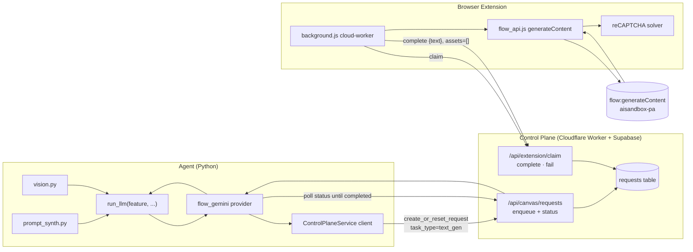
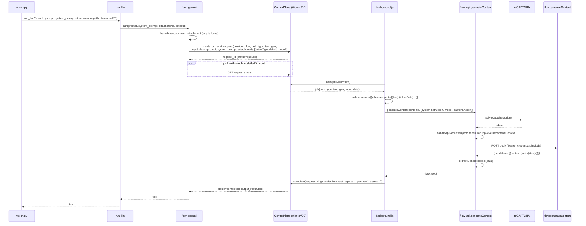

# Design Document

## Overview

This feature routes Flowboard's text generation through the **same extension pipeline** already used for Flow image and video generation, by calling `POST https://aisandbox-pa.googleapis.com/v1/flow:generateContent` with a Gemini-style payload. It replaces the unused, fragile `GeminiBrowserDriver` (Playwright/CDP scraping of `gemini.google.com`) with a job-based path (variant B of `docs/SPIKE-gemini-qua-flow-generatecontent.md`) that reuses the captured Flow Bearer token, the existing reCAPTCHA solver, and the Control-Plane claim/complete loop.

The user-visible result: `prompt_synth` (auto-prompt) and `vision` (multimodal image brief) gain a `$0` provider, `flow_gemini`, with **no change to their call sites** — both still call `run_llm("auto_prompt"/"vision", ...)`. The new provider enqueues a `task_type="text_gen"` request to the Control Plane, the extension cloud-worker claims it, calls `flow:generateContent`, and completes the job with the extracted text and an **empty assets array** (no R2 asset).

The feature spans four layers, each a thin addition to an existing seam:

| Layer | File | Addition |
|---|---|---|
| Extension request builder | `extension/flow_api.js` | `generateContent(contents, options)` + module helper `extractGeneratedText(data)` |
| Extension token injection + dispatch | `extension/background.js` | top-level `recaptchaContext.token` injection in `handleApiRequest`; `text_gen` branch in `runCloudFlowJob` |
| Control Plane | `cloudflare/control-plane-worker/src/routes/canvas.ts`, `extension.ts`, `lib/requestGuards.ts` | validate/allow `task_type="text_gen"`; store text-only completion with empty assets |
| Agent LLM registry | `agent/flowboard/services/llm/flow_gemini.py` (new) + `registry.py` | `flow_gemini` provider: build contents, enqueue, poll, return text |

Retirement: delete `gemini_browser_driver.py`, its test, the Playwright smoke/e2e scaffolding, and remove the Playwright dependency from the agent manifest.

### Key validated technical facts

- Endpoint: `POST https://aisandbox-pa.googleapis.com/v1/flow:generateContent`, `content-type: text/plain;charset=UTF-8`, `origin/referer: https://labs.google`, `authorization: Bearer <flowKey>`, `credentials: include`.
- Body shape: top-level `model`, `contents:[{role,parts:[{text}|{inlineData:{mimeType,data}}]}]`, optional `systemInstruction:{parts:[{text}]}`, optional `thinkingConfig:{thinkingLevel}`, optional `requestContext:{flowSdkInfo:{appletId,appletVersionId}}`, and **top-level** `recaptchaContext:{token,applicationType:"RECAPTCHA_APPLICATION_TYPE_WEB"}`. NO `clientContext`.
- Response: text lives in `candidates[].content.parts[].text`.

## Architecture

### System context



The path reuses the existing image/video plumbing verbatim; the only new vertices are `flow_gemini`, the `text_gen` dispatch branch, and the top-level `recaptchaContext` injection. Polling reuses the same `requests` row lifecycle (`queued → running → completed/failed`) that images and videos use; the only difference is the completion payload carries `text` instead of `media_urls`, and `assets` is empty.

### Why job-based (variant B)

The SPIKE offered (A) a synchronous `/api/text/generate` endpoint and (B) a job enqueue consistent with images/videos. Requirements pin variant B: it reuses the claim/complete loop, captcha solve, error sanitization, retry, and heartbeat already proven for media, with no new endpoint surface. The cost is latency (poll loop) which is acceptable for auto-prompt/vision (already 5–120s today on CLI providers).

### Multimodal vision request — end-to-end sequence



## Components and Interfaces

### 1. `flow_api.js` — `generateContent` + `extractGeneratedText`

A new instance method on `FlowboardFlowApi` mirroring the style of `generateImage` / `generateVideoOmni`, and a module-level helper exported on `FlowboardFlowApiUtils`.

Note the deliberate divergence from the image/video methods: `generateContent` builds a top-level `recaptchaContext` (not a `clientContext`) and does **not** call the `clientContext(projectId, tier)` helper. It still sets the captcha token inline when `solveCaptcha` is available (cloud-worker path), and `background.js` also patches the token at send time (defense in depth — see component 2).

```js
// Module-level constants
const GENERATE_CONTENT_URL = `${FLOW_API_BASE}/v1/flow:generateContent`;
const DEFAULT_TEXT_MODEL = 'gemini-3-flash-preview';   // Assumption A3, overridable
const CAPTCHA_TEXT = 'IMAGE_GENERATION';               // Assumption A1, overridable default

// Reads candidates[].content.parts[].text and concatenates in document order.
// Ignores non-text parts. Returns '' when no candidates / parts / text exist.
function extractGeneratedText(data) {
  const source = data?.data || data;          // tolerate {data:{...}} envelope like other extractors
  const candidates = source?.candidates;
  if (!Array.isArray(candidates)) return '';
  let out = '';
  for (const cand of candidates) {
    const parts = cand?.content?.parts;
    if (!Array.isArray(parts)) continue;
    for (const part of parts) {
      if (part && typeof part.text === 'string') out += part.text;
    }
  }
  return out;
}

class FlowboardFlowApi {
  // ...existing methods...

  /**
   * @param {Array} contents  [{ role, parts: [{text}|{inlineData:{mimeType,data}}] }]
   * @param {Object} [options] { model, systemInstruction, thinkingConfig,
   *                             requestContext, captchaAction }
   * @returns {Promise<{ raw: object, text: string }>}
   */
  async generateContent(contents, options) {
    const opts = options || {};
    const captchaToken = await this.solveCaptcha?.(opts.captchaAction || CAPTCHA_TEXT);
    if (!captchaToken) throw new Error('Missing reCAPTCHA token');

    const body = {
      model: opts.model || DEFAULT_TEXT_MODEL,
      contents,
      recaptchaContext: {                       // ← TOP-LEVEL (confirmed from real fetch)
        token: captchaToken,
        applicationType: 'RECAPTCHA_APPLICATION_TYPE_WEB',
      },
    };
    if (opts.systemInstruction) body.systemInstruction = opts.systemInstruction;
    if (opts.thinkingConfig)    body.thinkingConfig = opts.thinkingConfig;
    if (opts.requestContext)    body.requestContext = opts.requestContext;
    // NOTE: clientContext is intentionally never set for generateContent.

    const resp = await fetch(GENERATE_CONTENT_URL, {
      method: 'POST',
      headers: {
        'content-type': 'text/plain;charset=UTF-8',
        'accept': '*/*',
        'origin': 'https://labs.google',
        'referer': 'https://labs.google/',
        'authorization': this.bearerHeader(),
      },
      credentials: 'include',
      body: JSON.stringify(body),
    });

    let data;
    try {
      data = await resp.json();
    } catch (e) {
      throw new Error('generateContent malformed JSON response');
    }
    if (!resp.ok) throw new Error(`generateContent HTTP ${resp.status}`);
    return { raw: data, text: extractGeneratedText(data) };
  }
}

global.FlowboardFlowApiUtils = {
  extractMediaEntries, extractProjectId, clientContext, resolveImageModel,
  extractGeneratedText,   // ← newly exported
};
```

Design decisions:
- `systemInstruction`, `thinkingConfig`, `requestContext` are included **only when present** (Req 1.4–1.6). `requestContext` is omitted by default per Assumption A2 (request first attempted without `flowSdkInfo`).
- `extractGeneratedText` tolerates both the bare response and a `{data:{...}}` envelope, consistent with `extractMediaEntries`.
- The malformed-JSON case is detected before the `resp.ok` check so a non-2xx **and** unparseable body still surfaces a clear error (Req 8.6); a parseable non-2xx surfaces the status code (Req 8.3).

### 2. `background.js` — top-level token injection + `text_gen` dispatch

#### 2a. Top-level `recaptchaContext` injection in `handleApiRequest`

The existing block clones the body and patches `clientContext.recaptchaContext`, `agentClientContext.recaptchaContext`, and `requests[].clientContext.recaptchaContext`. Add a fourth case for the top-level object. This sits inside the existing `if (captchaToken && finalBody)` clone block so it only runs when a token was solved and never mutates the caller's object (Req 3.1–3.3).

```js
// inside handleApiRequest, after the existing requests[] loop:
if (finalBody.recaptchaContext && typeof finalBody.recaptchaContext === 'object') {
  finalBody.recaptchaContext.token = captchaToken;
}
```

Idempotence/position note: each injection site is guarded by its own presence check and writes only the `.token` field, so running the block twice on the same body yields the same result, and a body lacking a top-level `recaptchaContext` is left untouched at that location (the other three locations behave exactly as before).

Captcha action resolution reuses `resolveCaptchaAction(url, captchaAction)` / `observedCaptchaActions` already in `background.js`. For `generateContent` the action defaults to `IMAGE_GENERATION` (Assumption A1) and is overridable via the job's `captchaAction`; if `injected.js OBSERVE_EVENT` has observed a more specific action for the `generateContent` href, `getBestObservedCaptchaSnapshot` will surface it (Req 3.4).

#### 2b. `text_gen` branch in `runCloudFlowJob`

`runCloudFlowJob` currently branches on `isVideoTask` vs image/edit. Add an early `text_gen` branch that runs **before** the project-creation and ref-media resolution code (text gen needs neither a Flow project nor R2 uploads). It builds `contents`, calls `generateContent`, and completes with `{provider, task_type, text}` and `assets=[]`.

```js
// near the top of runCloudFlowJob, after flowApi is constructed and
// after the preparing/submitting progress calls:
if (taskType === 'text_gen') {
  const sysText = typeof inputData.system_prompt === 'string' && inputData.system_prompt
    ? inputData.system_prompt : null;
  const attachments = Array.isArray(inputData.attachments) ? inputData.attachments : [];
  const parts = [{ text: prompt }];
  for (const att of attachments) {
    if (att && typeof att.data === 'string' && att.data) {
      parts.push({ inlineData: { mimeType: att.mimeType || 'image/png', data: att.data } });
    }
  }
  const contents = [{ role: 'user', parts }];
  const options = {
    model: inputData.model || cloudConfig?.textModel || undefined,
    captchaAction: inputData.captcha_action || undefined,
  };
  if (sysText) options.systemInstruction = { parts: [{ text: sysText }] };

  const result = await withStage(
    'ERR_STAGE_GENERATE',
    () => flowApi.generateContent(contents, options),
    'Google Flow text generation failed'
  );

  await withStage(
    'ERR_STAGE_COMPLETE',
    () => completeCloudRequestWithRetry(
      cloud, requestId,
      { provider: 'flow', task_type: 'text_gen', text: result.text || '' },
      []                                   // ← empty assets array
    ),
    'Complete request failed'
  );
  metrics.successCount++;
  metrics.lastError = null;
  chrome.storage.local.set({ metrics });
  return;                                  // text_gen handled; skip image/video paths
}
```

The pre-existing guard `if (typeof prompt !== 'string' || !prompt.trim()) throw ...` and `if (!flowKey) throw ...` already cover the empty-prompt and no-bearer cases for all task types (Req 8.1 surfaces as a `fail` with a sanitized reason; the `NO_FLOW_KEY` fast-path in `handleApiRequest` covers the WS path). Errors from `generateContent` propagate to the existing `catch` that calls `cloud.fail(requestId, sanitizedReason)` (Req 4.4, Req 8).

### 3. Control Plane Worker — `text_gen` validation + text-only completion

#### 3a. Allow-list `task_type`

`canvas.ts` already passes `body.task_type ?? 'txt2img'` into the `create_or_reset_request` RPC. Add an explicit allow-list so an unrecognized value is rejected with a client error (Req 5.1, 5.3). Mirror the `requestGuards.ts` style (a `Set` + an `assert` helper throwing `ApiError(400, ...)`).

```ts
// src/lib/requestGuards.ts
export const ALLOWED_TASK_TYPES = new Set([
  'txt2img', 'edit_image', 'img2vid', 'txt2vid_omni', 'text_gen',
]);

export function assertTaskType(taskType: unknown): string {
  const value = typeof taskType === 'string' && taskType ? taskType : 'txt2img';
  if (!ALLOWED_TASK_TYPES.has(value)) {
    throw new ApiError(400, 'INVALID_TASK_TYPE', `Unsupported task_type: ${String(taskType)}`);
  }
  return value;
}
```

```ts
// src/routes/canvas.ts, in POST /requests, before the RPC call:
const taskType = assertTaskType(body.task_type);
// ...
p_task_type: taskType,
p_expected_output: body.expected_output ?? (taskType === 'text_gen' ? 'text' : 'image'),
```

`expected_output` defaults to `'text'` for `text_gen` (it defaults to `'image'` for everything else), so the row records that this request yields text rather than media.

#### 3b. Text-only completion with empty assets

`extension.ts`'s `/extension/complete` already accepts `assets: z.array(...).default([])` and only runs `headObject`/size checks **per asset**. With an empty array the loop is skipped and `complete_request_with_assets` is called with `p_assets: []` — so a text-only completion needs **no schema change** (Req 5.2). The `output_result` is `z.record(z.unknown())`, which already accepts `{provider, task_type, text}`.

#### 3c. Read-back path

`GET /api/canvas/requests/:id` returns the row. Its completed-branch augments `output_result` with `media_ids`/`media_urls`/`asset_ids` derived from the `assets` table. For a `text_gen` row there are no assets, so `media_urls` resolves to `[]` and `media_ids` falls back to `output_result.media_ids` (absent → `[]`); critically, the existing `...output` spread **preserves `output_result.text`** (Req 5.4). No change is required, but the design notes this so the agent reads `output_result.text`.

### 4. Agent — `flow_gemini` LLM provider

New file `agent/flowboard/services/llm/flow_gemini.py` conforming to the `LLMProvider` protocol (structural typing, like `GeminiProvider`). Registered in `registry.py`'s `_PROVIDERS` dict.

```python
class FlowGeminiProvider:
    name: str = "flow_gemini"
    supports_vision: bool = True            # Req 6.5

    def __init__(self, control_plane: ControlPlaneService | None = None) -> None:
        self._cp = control_plane
        self._poll_interval = 2.0
        self._board_id = os.getenv("FLOWBOARD_TEXT_GEN_BOARD_ID", "") or None

    async def is_available(self) -> bool:
        # Usable when a Control Plane is configured (SUPABASE_URL set) and
        # a worker identity exists. Does NOT call the model.
        return bool(SUPABASE_URL) and bool(EXT_CLIENT_ID or self._board_id)

    async def run(
        self,
        user_prompt: str,
        *,
        system_prompt: Optional[str] = None,
        attachments: Optional[list[str]] = None,
        timeout: float = 90.0,
    ) -> str:
        # 1. Build input_data: prompt + optional system_prompt + base64 attachments
        input_data = self._build_input_data(user_prompt, system_prompt, attachments)
        # 2. Enqueue text_gen request via ControlPlaneService.create_or_reset_request
        request = await self._enqueue(input_data)
        # 3. Poll request status until completed / failed / timeout
        text = await self._poll_until_text(request["id"], timeout)
        # 4. Validate + return
        if not text or not text.strip():
            raise LLMError("flow_gemini returned an empty response")   # Req 8.4
        return text.strip()

    def _build_input_data(self, user_prompt, system_prompt, attachments) -> dict:
        if system_prompt is not None and not isinstance(system_prompt, str):
            raise LLMError("flow_gemini: system_prompt could not be encoded")  # Req 6.4
        atts: list[dict] = []
        for path in attachments or []:
            try:
                raw = Path(path).read_bytes()
                atts.append({
                    "mimeType": _guess_mime(path),
                    "data": base64.b64encode(raw).decode("ascii"),
                })
            except Exception as exc:                 # Req 7.2 — skip & continue
                logger.warning("flow_gemini: skipped attachment %s (%s)",
                               _redact_path(path), type(exc).__name__)
        data = {"prompt": user_prompt, "model": _DEFAULT_TEXT_MODEL}
        if system_prompt:
            data["system_prompt"] = system_prompt    # Req 6.3
        if atts:
            data["attachments"] = atts               # Req 7.1; omitted when empty (Req 7.5)
        return data
```

Design decisions:
- **Enqueue/poll** uses the existing `ControlPlaneService` (`agent/flowboard/services/control_plane.py`): `create_or_reset_request(user_id, board_id, node_id, provider="flow", task_type="text_gen", input_data, idempotency_key, expected_output="text")`, then read status via `_get_request(request_id)` (or the public status read) on a `2s` interval until `status in {completed, failed}` or the `timeout` budget elapses (Req 6.2, 8.5).
- **System prompt** is carried in `input_data.system_prompt` and turned into `systemInstruction` by the cloud-worker. If it cannot be represented (non-string), the provider raises `LLMError` and does **not** enqueue (Req 6.4) — it never silently drops the system prompt.
- **Vision**: `supports_vision = True`, so the registry's vision gate lets attachments through (Req 6.5). Attachments are absolute paths (same contract as `vision.py`); each is read and base64-encoded; per-attachment failures are skipped (Req 7.2).
- **No call-site changes**: `registry.run_llm` already dispatches by the configured provider name; registering `flow_gemini` is sufficient for `prompt_synth`/`vision` to route to it once the user selects it in Settings (Req 6.6, 6.7).
- **Timeout** maps to an `LLMError` on expiry (Req 8.5); empty completed text maps to an `LLMError` (Req 8.4).

#### Registry registration

```python
# registry.py
from .flow_gemini import FlowGeminiProvider
_PROVIDERS: dict[str, LLMProvider] = {
    "claude": ClaudeProvider(),
    "gemini": GeminiProvider(),
    "openai": OpenAIProvider(),
    "flow_gemini": FlowGeminiProvider(),   # ← new
}
```

### 5. Retirement of the Playwright Gemini driver

| File | Action |
|---|---|
| `agent/flowboard/extension_worker/gemini_browser_driver.py` | delete (Req 10.1) |
| `agent/tests/test_gemini_browser_driver.py` | delete (Req 10.1) |
| Playwright-only Gemini smoke / e2e scaffolding (`gemini_smoke.py`, `gemini_e2e_smoke.py` if present) | delete (Req 10.2) |
| `agent/pyproject.toml` | no Playwright entry exists in `dependencies`/`dev` today; confirm and remove any `playwright` reference if one surfaces in a lock/extra (Req 10.3) |

Verification (Req 10.4): after deletion, run an import smoke (`python -c "import flowboard.services.llm.registry"` and the agent app import) to confirm no module references the removed driver. `flow_browser_driver.py` and `flow_api_driver.py` do **not** use Playwright (they use plain CDP websockets / the WS bridge), so they stay. The grep confirmed `playwright` appears only in `gemini_browser_driver.py` and its test — removing both clears the dependency.

### 6. Self-discovery of captcha action + `flowSdkInfo` (resolves A1/A2)

Both open assumptions — A1 (captcha action string) and A2 (`requestContext.flowSdkInfo`) — are turned from runtime unknowns into **self-healing, passively-observed** values by reusing the observe-and-store pattern already proven in this extension: the `grecaptcha.enterprise.execute` wrap in `injected.js`, the `OBSERVE_EVENT` relay in `content.js`, and the `observedCaptchaActions` store + `resolveCaptchaAction`/`getBestObservedCaptchaSnapshot` in `background.js`. When Google bumps the Flow applet version, the observer re-captures the new value automatically on the next Flow-page request — no code change required.

This component is **passive telemetry capture plus a retry chain**; it introduces no behavior change to the Flow page (every wrapped call forwards to the original, exactly like the existing `grecaptcha` wrap forwarding to `originalExecute`).

#### 6a. Captcha action (A1) — already covered, with an href note

The existing `OBSERVE_EVENT` (`FLOWBOARD_GRECAPTCHA_EXECUTE_OBSERVED`) path already dispatches `{action, scope, siteKey, href, observedAt}` whenever the Flow page itself calls `grecaptcha.enterprise.execute`. `content.js` relays it as `CAPTCHA_ACTION_OBSERVED`; `background.js` stores it in `observedCaptchaActions` (chrome.storage) and `getBestObservedCaptchaSnapshot(url, action)` / `resolveCaptchaAction(url, requestedAction)` already rank the best observed action by href/action match.

No new code is strictly required for A1. The one design note: `getBestObservedCaptchaSnapshot` keys its href-match off the request URL, so for `generateContent` the lookup must run against the **`flow:generateContent` URL**. Today `resolveCaptchaAction` only special-cases `flowCreationAgent:streamChat` (it returns `requestedAction || null` for everything else and never consults observed snapshots). To let an observed action override the `IMAGE_GENERATION` default for `generateContent`, extend `resolveCaptchaAction`'s URL branch to also match `flow:generateContent` — consulting `getBestObservedCaptchaSnapshot(url, requestedAction)` first and falling back to `requestedAction` (which defaults to `IMAGE_GENERATION`, component 2a). Until an action is observed for that href, the default stays `IMAGE_GENERATION` (Req 3.4).

#### 6b. `flowSdkInfo` (A2) auto-capture — new passive `fetch` observer

Extend `injected.js` to passively observe outbound `window.fetch` calls, mirroring the established fetch handling already in this file (`FORWARD_FETCH_EVENT`). Wrap `window.fetch` once (guarded by a flag, like `ensureWrapped`); when the request URL is `flow:generateContent` or `flowAgent:*`, parse the request body and extract `requestContext.flowSdkInfo` (`appletId`, `appletVersionId`) and/or `agentClientContext` / `appletProjectId`, then dispatch a new observe event `FLOWBOARD_FLOW_SDK_INFO_OBSERVED` with `{appletId, appletVersionId, appletProjectId, href, observedAt}`. The original `fetch` is always called through unchanged.

```js
// injected.js — added alongside the existing grecaptcha wrap and OBSERVE_EVENT
const FLOW_SDK_INFO_OBSERVE_EVENT = 'FLOWBOARD_FLOW_SDK_INFO_OBSERVED';

// Pure, tolerant field-reader (parallels extractGeneratedText): present → value, absent/malformed → null
function extractFlowSdkInfo(rawBody) {
  let body;
  try { body = typeof rawBody === 'string' ? JSON.parse(rawBody) : rawBody; }
  catch { return null; }
  const sdk = body?.requestContext?.flowSdkInfo;
  const appletId        = sdk?.appletId        || body?.agentClientContext?.appletId        || null;
  const appletVersionId = sdk?.appletVersionId || null;
  const appletProjectId = body?.appletProjectId || body?.agentClientContext?.appletProjectId || null;
  if (!appletId && !appletVersionId && !appletProjectId) return null;
  return { appletId, appletVersionId, appletProjectId };
}

function ensureFetchObserved() {
  if (window.fetch.__flowboardSdkObserved) return;
  const originalFetch = window.fetch.bind(window);
  const wrapped = function (input, init) {
    try {
      const url = typeof input === 'string' ? input : (input?.url || '');
      if (/flow:generateContent|flowAgent:/.test(url)) {
        const info = extractFlowSdkInfo(init?.body);
        if (info) {
          window.dispatchEvent(new CustomEvent(FLOW_SDK_INFO_OBSERVE_EVENT, {
            detail: { ...info, href: window.location.href, observedAt: Date.now() },
          }));
        }
      }
    } catch {}
    return originalFetch(input, init);   // always pass through — no page behavior change
  };
  wrapped.__flowboardSdkObserved = true;
  window.fetch = wrapped;
}
void ensureFetchObserved();
```

`content.js` relays the event to `background.js` as a `FLOW_SDK_INFO_OBSERVED` runtime message (mirroring the `CAPTCHA_ACTION_OBSERVED` relay). `background.js` keeps the latest non-empty value in `observedFlowSdkInfo`, loaded on startup alongside `observedCaptchaActions`:

```js
// background.js — startup load
const data = await chrome.storage.local.get([/* ...existing keys... */, 'observedFlowSdkInfo']);
if (data.observedFlowSdkInfo) observedFlowSdkInfo = data.observedFlowSdkInfo;

// background.js — onMessage relay (next to CAPTCHA_ACTION_OBSERVED)
if (msg.type === 'FLOW_SDK_INFO_OBSERVED') {
  const appletId        = typeof msg.appletId === 'string'        ? msg.appletId.trim()        : '';
  const appletVersionId = typeof msg.appletVersionId === 'string' ? msg.appletVersionId.trim() : '';
  if (appletId || appletVersionId) {
    observedFlowSdkInfo = {
      appletId:        appletId || null,
      appletVersionId: appletVersionId || null,
      href:            msg.href || null,
      observedAt:      typeof msg.observedAt === 'number' ? msg.observedAt : Date.now(),
    };
    chrome.storage.local.set({ observedFlowSdkInfo });
    console.log('[Flowboard] Observed flowSdkInfo', appletId, appletVersionId);
  }
  return;
}
```

The `text_gen` dispatch (component 2b) reads this store and populates `options.requestContext` **only when** a non-empty value is available — preserving the Req 1.6 "omit when absent" contract:

```js
// inside the text_gen branch, while building options:
const sdk = resolveFlowSdkInfo();          // observed → seed constants → null (component 6c)
if (sdk) options.requestContext = { flowSdkInfo: sdk };
```

#### 6c. 3-tier fallback chain

`resolveFlowSdkInfo()` plus the `generateContent` dispatch implement a three-tier chain so the request works whether or not `flowSdkInfo` is actually required, and self-heals on applet-version bumps:

1. **Tier 1 — omit (default, try first).** Send WITHOUT `requestContext` entirely. `flowSdkInfo` is almost certainly telemetry, so this is expected to succeed; it is also the existing Req 1.6 behavior, so the happy path is unchanged.
2. **Tier 2 — observed value.** If a request fails in a way that indicates `flowSdkInfo` is required (e.g. a `400`/`INVALID_ARGUMENT` whose message references `flowSdkInfo` / `requestContext` / `applet`), retry once using `observedFlowSdkInfo` captured in 6b.
3. **Tier 3 — seed constants.** If nothing has been observed yet, fall back to the known captured constants as a last-resort seed:
   - `appletId = "96d388e5-41e3-4661-8102-57479ac91729"`
   - `appletVersionId = "fbca04f3-c5cc-4b69-8c91-4c88abb1e9a3"`
   These live in `cloudConfig` (e.g. `cloudConfig.flowSdkInfoSeed`) so they are **overridable without a code change** when Google rotates the applet version.

`resolveFlowSdkInfo()` precedence: `observedFlowSdkInfo` → `cloudConfig.flowSdkInfoSeed` → `null`. Tier 1 ignores the resolved value on the first attempt; Tiers 2–3 apply it on the `flowSdkInfo`-required retry.

The **analogous captcha-action chain** (A1), already largely in place: observed action (by `generateContent` href, 6a) → `IMAGE_GENERATION` default → on `403`/`CAPTCHA_FAILED`, retry candidate actions (e.g. `IMAGE_GENERATION`, then any observed alternatives) and log which action succeeds, so the winning value is recorded (via the existing `observedCaptchaActions` store) for subsequent requests.

#### 6d. Testing note (no new correctness property)

This subsection is observer + retry **wiring**, classified EXAMPLE / EDGE_CASE / INTEGRATION / SMOKE — it adds no new universal "for all inputs" invariant beyond those already captured in Correctness Properties. The only pure fragment, `extractFlowSdkInfo(body)`, is a thin tolerant field-reader whose behavior parallels Property 2's `extractGeneratedText` (present → returns the value; absent / malformed → returns `null`); it is covered by example + edge-case unit tests (valid body, missing `requestContext`, non-JSON body, `flowAgent:*` body) rather than a dedicated property. The 3-tier selection (omit → observed → seed) and the captcha-action retry are deterministic example/integration cases (a specific error class triggers a specific retry), where 100 iterations reveal nothing more than 2–3 representative cases. The prework reflection found no meaningfully input-varying invariant here, so **no new correctness property is added**.

## Data Models

### `text_gen` request `input_data` (agent → Control Plane)

```jsonc
{
  "prompt": "Describe this image.",          // required, non-empty
  "system_prompt": "You are a ...",          // optional (→ systemInstruction)
  "model": "gemini-3-flash-preview",         // optional (default A3)
  "captcha_action": "IMAGE_GENERATION",      // optional (default A1)
  "attachments": [                            // optional; omitted when empty
    { "mimeType": "image/png", "data": "<base64>" }
  ]
}
```

### `text_gen` completion `output_result` (extension → Control Plane)

```jsonc
{
  "provider": "flow",
  "task_type": "text_gen",
  "text": "<Generated_Text>"
}
```
Completion `assets` array is always `[]` for `text_gen`.

### `flow:generateContent` request body (extension → aisandbox-pa)

```jsonc
{
  "model": "gemini-3-flash-preview",
  "contents": [
    { "role": "user",
      "parts": [
        { "text": "Describe this image." },
        { "inlineData": { "mimeType": "image/png", "data": "<base64>" } }
      ] }
  ],
  "systemInstruction": { "parts": [ { "text": "You are a ..." } ] },   // optional
  "thinkingConfig": { "thinkingLevel": "HIGH" },                       // optional
  "requestContext": { "flowSdkInfo": { "appletId": "...", "appletVersionId": "..." } }, // optional, omitted by default (A2)
  "recaptchaContext": {                                                 // TOP-LEVEL
    "token": "<reCAPTCHA token>",
    "applicationType": "RECAPTCHA_APPLICATION_TYPE_WEB"
  }
}
```
No `clientContext` (Req 1.9).

### `flow:generateContent` response (aisandbox-pa → extension)

```jsonc
{
  "candidates": [
    { "content": { "role": "model", "parts": [ { "text": "..." }, { "text": "..." } ] } }
  ]
}
```
`extractGeneratedText` concatenates `candidates[].content.parts[].text` in document order, ignoring non-text parts.

### `parts[]` entry shapes

- Text part: `{ "text": string }`
- Inline data part: `{ "inlineData": { "mimeType": string, "data": <base64 string> } }`

### `observedFlowSdkInfo` store (chrome.storage, populated by component 6b)

The latest passively-observed Flow SDK telemetry. `null`/absent until a Flow-page `flow:generateContent` / `flowAgent:*` request has been seen.

```jsonc
{
  "appletId": "96d388e5-41e3-4661-8102-57479ac91729",   // string | null
  "appletVersionId": "fbca04f3-c5cc-4b69-8c91-4c88abb1e9a3", // string | null
  "href": "https://labs.google/fx/tools/flow/...",       // observed page URL | null
  "observedAt": 1735000000000                             // epoch ms
}
```

`requestContext` in the `flow:generateContent` body (above) is now **conditionally populated** from observation rather than always omitted: it is included only when `resolveFlowSdkInfo()` (observed → `cloudConfig.flowSdkInfoSeed` seed constants → `null`) yields a non-empty value AND the request is on the Tier-2/Tier-3 `flowSdkInfo`-required retry path (component 6c). Tier 1 still omits it, preserving Req 1.6.

The seed constants live in `cloudConfig.flowSdkInfoSeed` so they can be updated without a code change:

```jsonc
{
  "flowSdkInfoSeed": {
    "appletId": "96d388e5-41e3-4661-8102-57479ac91729",
    "appletVersionId": "fbca04f3-c5cc-4b69-8c91-4c88abb1e9a3"
  }
}
```

## Correctness Properties

*A property is a characteristic or behavior that should hold true across all valid executions of a system — essentially, a formal statement about what the system should do. Properties serve as the bridge between human-readable specifications and machine-verifiable correctness guarantees.*

The prework analysis classified most acceptance criteria as EXAMPLE/EDGE_CASE/INTEGRATION/SMOKE (specific wiring, error mappings, validation, and file-deletion checks). Five criteria families are genuine universal properties suitable for property-based testing. They were consolidated to remove redundancy (e.g. all of Req 1's body-shape clauses describe one pure body builder; all of Req 2's clauses describe one pure extractor; Req 3's three injection clauses describe one idempotent transform; Req 4.3/7.1/7.3/7.5 describe one contents builder).

### Property 1: generateContent request body is built correctly

*For all* `options` objects (with `model` present or absent, and any subset of `systemInstruction` / `thinkingConfig` / `requestContext` present or absent) and any `contents` array, the body produced by `generateContent` SHALL satisfy: `body.model` equals `options.model` when supplied and `"gemini-3-flash-preview"` otherwise; `body.contents` deep-equals the supplied `contents`; each optional field (`systemInstruction`, `thinkingConfig`, `requestContext`) is present in the body if and only if it was supplied; `body.recaptchaContext` exists at the top level with `applicationType === "RECAPTCHA_APPLICATION_TYPE_WEB"`; and `body` contains no `clientContext` key.

**Validates: Requirements 1.2, 1.3, 1.4, 1.5, 1.6, 1.7, 1.9**

### Property 2: text extraction round-trip

*For all* lists of text strings, synthesizing a response whose `candidates[].content.parts[]` carry those strings (interleaved arbitrarily with non-text parts and empty candidates) and then applying `extractGeneratedText` SHALL reproduce the in-order concatenation of exactly those text strings; and *for all* response objects with no `candidates` array or no `text`-bearing parts, `extractGeneratedText` SHALL return the empty string.

**Validates: Requirements 2.1, 2.2, 2.3, 2.4**

### Property 3: captcha token injection is position-correct and idempotent

*For all* request bodies containing any subset of the recaptcha locations (top-level `recaptchaContext`, `clientContext.recaptchaContext`, `agentClientContext.recaptchaContext`, and each `requests[].clientContext.recaptchaContext`), applying the `handleApiRequest` token injection with a solved token SHALL set `.token` to that token at every location that is present, SHALL NOT create a `recaptchaContext` at any location that was absent, and SHALL be idempotent (applying the injection twice yields a body identical to applying it once).

**Validates: Requirements 3.1, 3.2, 3.3**

### Property 4: contents builder assembles user parts from job input

*For all* non-empty prompt strings and *for all* attachment lists (including the empty list), the `text_gen` contents builder SHALL produce a single `user` content whose `parts` array begins with exactly one `{ text }` entry equal to the prompt, followed by exactly one `{ inlineData: { mimeType, data } }` entry per supplied attachment in the same order; when the attachment list is empty the `parts` array SHALL contain only the text entry.

**Validates: Requirements 4.3, 7.1, 7.3, 7.5**

### Property 5: attachment base64 encode/decode round-trip

*For all* image byte sequences, base64-encoding the bytes into an `inlineData.data` field and then base64-decoding that field SHALL reproduce the original bytes exactly.

**Validates: Requirements 7.4**

## Error Handling

All errors are sanitized to exclude the Bearer token and the reCAPTCHA token (Req 9.1, 9.3). Each failure maps to a single, diagnosable behavior consistent with the existing image/video pipeline.

| Failure | Detected in | Behavior | Surfaced as |
|---|---|---|---|
| No Bearer token | `handleApiRequest` (WS) fast-path / `runCloudFlowJob` guard | Do not call `generateContent`; fail fast | `NO_FLOW_KEY` (503 on WS path); cloud job → `cloud.fail(requestId, "NO_FLOW_KEY")` (Req 8.1) |
| reCAPTCHA solve fails | `generateContent` (`!captchaToken`) / `solveCaptcha` returns error | Throw before fetch; do not call `generateContent` | `CAPTCHA_FAILED: <reason>` → `cloud.fail` with sanitized reason (Req 8.2) |
| HTTP non-2xx | `generateContent` after parse | Throw error including the status code | `Error("generateContent HTTP <status>")` → `cloud.fail` (Req 8.3) |
| Malformed JSON body | `generateContent` (`resp.json()` throws) | Throw malformed-response error | `Error("generateContent malformed JSON response")` → `cloud.fail` (Req 8.6) |
| Empty generated text | `FlowGeminiProvider.run` after poll completes | Raise `LLMError` indicating empty response | `LLMError("flow_gemini returned an empty response")` (Req 8.4) |
| Job timeout | `FlowGeminiProvider._poll_until_text` budget exceeded | Raise `LLMError` indicating timeout | `LLMError("flow_gemini timed out after <t>s")` (Req 8.5) |
| Generation failure (any of the above, cloud side) | `runCloudFlowJob` catch | `cloud.fail(requestId, sanitizedReason)` | request row → `status=failed`, agent poll observes failure (Req 4.4) |
| Per-attachment encode failure | `FlowGeminiProvider._build_input_data` | Skip that attachment, continue with the rest | warning log (redacted path); no raise (Req 7.2) |
| Non-string `system_prompt` | `FlowGeminiProvider._build_input_data` | Raise `LLMError`; do NOT enqueue | `LLMError("flow_gemini: system_prompt could not be encoded")` (Req 6.4) |
| Unrecognized `task_type` | Worker `assertTaskType` | Reject with client error | `ApiError(400, "INVALID_TASK_TYPE")` (Req 5.3) |

Secrets/redaction (Req 9): the provider never logs `flowKey`/Bearer or the reCAPTCHA token. Dispatch logs record prompt length and a short SHA-256 hash (mirroring the existing `gemini_browser_driver` redaction pattern and `control_plane.hash_secret`) rather than raw prompt content when it matches a sensitive pattern. Error messages are constructed from fixed strings + status codes only.

## Testing Strategy

This feature mixes pure logic (strong PBT candidates) with wiring/IaC-like glue (example/integration/smoke). The strategy below applies PBT only where a meaningful "for all inputs" statement exists, and uses example/integration/smoke tests elsewhere — matching the existing repo conventions (vitest for JS in `cloudflare/control-plane-worker` and the frontend; pytest + hypothesis for the agent, already in `pyproject.toml` dev extras).

### Property-based tests

Each property test runs a **minimum of 100 iterations** and is tagged with a comment referencing the design property, format: `Feature: gemini-via-flow-generatecontent, Property {n}: {property_text}`. PBT libraries: **fast-check** for the JS/extension code (add as a dev dependency to a `extension`/worker test package), **hypothesis** for the Python provider (already available).

| Property | Where | Library | What varies |
|---|---|---|---|
| Property 1 — body builder | `flow_api.js` (`generateContent` via stubbed `fetch`/`solveCaptcha`) | fast-check | model present/absent, optional-field subsets, arbitrary `contents` |
| Property 2 — extractor round-trip | `flow_api.js` (`extractGeneratedText`) | fast-check | lists of text strings, interleaved non-text parts, empty candidates |
| Property 3 — token injection | extracted pure injection helper from `handleApiRequest` | fast-check | bodies with arbitrary subsets of the 4 recaptcha locations; applied once vs twice |
| Property 4 — contents builder | extracted pure `buildTextGenContents(inputData)` helper (used by `runCloudFlowJob`) | fast-check | arbitrary prompt + attachment lists incl. empty |
| Property 5 — base64 round-trip | `flow_gemini.py` attachment encoder | hypothesis | arbitrary `bytes` (incl. empty, binary, large) |

To make Properties 3 and 4 testable as pure functions, the injection logic and the contents-assembly logic SHOULD be factored into small exported helpers (e.g. `injectCaptchaToken(body, token)` and `buildTextGenContents(inputData)`) that `handleApiRequest` and `runCloudFlowJob` call. This keeps the property tests free of Chrome/`fetch` mocking.

### Unit / example tests (vitest + pytest)

- **flow_api.js** (vitest): `generateContent` POSTs to the correct URL with `authorization` Bearer and `credentials:include` (Req 1.8); returns `{raw, text}` (Req 1.1); non-2xx → throws with status (Req 8.3); invalid JSON → throws malformed (Req 8.6).
- **background.js** (vitest): `text_gen` branch calls `generateContent` (Req 4.1) and completes with `{provider, task_type, text}` + `[]` assets (Req 4.2); generation error → `cloud.fail` (Req 4.4); no `flowKey` → `NO_FLOW_KEY`, `generateContent` not called (Req 8.1); captcha null → no fetch (Req 8.2); default captcha action `IMAGE_GENERATION` (Req 3.4).
- **flow_gemini.py** (pytest): registered + protocol-conforming (Req 6.1); `supports_vision is True` (Req 6.5); `run` enqueues and returns completed text via a mocked `ControlPlaneService` (Req 6.2); `system_prompt` carried into `input_data.system_prompt` (Req 6.3); non-string `system_prompt` → `LLMError`, no enqueue (Req 6.4); empty completed text → `LLMError` (Req 8.4); poll timeout → `LLMError` (Req 8.5); unreadable attachment skipped, others kept (Req 7.2).
- **registry.py** (pytest): configuring `flow_gemini` routes `auto_prompt` and `vision` through `FlowGeminiProvider.run` with no call-site change (Req 6.6, 6.7).
- **Redaction** (pytest): Bearer/reCAPTCHA tokens never appear in logs or error messages; sensitive-pattern prompt content is hashed/redacted (Req 9.1, 9.2, 9.3).
- **self-discovery observer** (vitest, component 6): `extractFlowSdkInfo` returns `{appletId, appletVersionId, appletProjectId}` for a body carrying `requestContext.flowSdkInfo`, returns `null` for a body without it, and returns `null` for a non-JSON body (example + edge cases); the `fetch` wrap dispatches `FLOWBOARD_FLOW_SDK_INFO_OBSERVED` only for `flow:generateContent`/`flowAgent:*` URLs and always forwards to the original `fetch`; `resolveFlowSdkInfo()` precedence is observed → `cloudConfig.flowSdkInfoSeed` → `null`; and the 3-tier request chain omits `requestContext` on the first attempt and retries with the resolved value only on a `flowSdkInfo`-required error (A1/A2 — example/integration, not PBT; see component 6d).

### Integration tests (Worker, vitest)

- `assertTaskType('text_gen') === 'text_gen'`; unknown value throws `ApiError(400)` (Req 5.1, 5.3) — colocate with `test/guards.test.ts`.
- `/extension/complete` with `output_result={provider,task_type,text}` and `assets=[]` succeeds without an asset record (Req 5.2); `GET /requests/:id` preserves `output_result.text` for a completed `text_gen` row (Req 5.4). 1–3 representative examples (these test Worker/DB wiring, not input-varying logic).

### Smoke tests (retirement, Req 10)

- After deleting `gemini_browser_driver.py` + `test_gemini_browser_driver.py` and any Playwright-only Gemini smoke/e2e files, run an import smoke: `python -c "import flowboard.services.llm.registry"` and an app import — no `ImportError` referencing removed modules (Req 10.4).
- `grep -ri playwright agent/` returns no matches outside removed files; confirm `agent/pyproject.toml` has no `playwright` entry (Req 10.1, 10.2, 10.3). On Windows/PowerShell use the repo's existing search tooling rather than `grep`.

### Notes on what is NOT property-tested

- Control Plane routes and the `/extension/complete` empty-asset path are **integration** concerns (Worker/DB wiring; behavior does not vary meaningfully with input) — 1–3 examples, not 100 iterations.
- File deletion and dependency-manifest changes (Req 10) are **smoke** checks.
- Error mappings (Req 8.1–8.6) and dispatch wiring (Req 4.1, 4.2, 4.4) are deterministic **examples** — input variation does not reveal more bugs than a couple of representative cases.

## Open assumptions and safe fallbacks

| Assumption | Handling | Fallback |
|---|---|---|
| **A1** — captcha action for `generateContent` | **Self-discovered** via the `injected.js` `grecaptcha.execute` wrap → `OBSERVE_EVENT` → `observedCaptchaActions` store; `resolveCaptchaAction`/`getBestObservedCaptchaSnapshot` pick the best observed action by the `flow:generateContent` href (component 6a). Captcha-action chain: observed (by href) → `IMAGE_GENERATION` default → on `403`/`CAPTCHA_FAILED`, retry candidate actions and record the winner (component 6c). | default `IMAGE_GENERATION` until an action is observed for that href (Req 3.4) — no longer a pure unknown |
| **A2** — `requestContext.flowSdkInfo` (`appletId`, `appletVersionId`) | **Self-discovered** via a new passive `window.fetch` observer in `injected.js` (`FLOWBOARD_FLOW_SDK_INFO_OBSERVED` → `observedFlowSdkInfo` store, component 6b). 3-tier request chain (component 6c): **Tier 1** omit `requestContext` (try first; telemetry, likely works) → **Tier 2** retry with observed `observedFlowSdkInfo` on a `flowSdkInfo`-required `400`/`INVALID_ARGUMENT` → **Tier 3** seed constants (`appletId 96d388e5-…`, `appletVersionId fbca04f3-…`) from `cloudConfig.flowSdkInfoSeed`. | Tier 1 omission preserves Req 1.6; seed constants are config-overridable so applet-version bumps need no code change — no longer a pure unknown |
| **A3** — model identifier | `options.model` / `input_data.model` / `cloudConfig.textModel` | default `gemini-3-flash-preview`, overridable via config (Req 1.2) |

---

## Tóm tắt (Vietnamese summary)

Thiết kế này cho phép Flowboard sinh văn bản (auto-prompt và vision brief) **miễn phí** bằng cách đi qua chính phiên Google Flow của người dùng, thay vì gọi Claude/OpenAI hay Gemini API trả phí. Cụ thể:

- **Extension** (`flow_api.js`): thêm `generateContent(contents, options)` dựng body kiểu Gemini với `recaptchaContext` ở **cấp cao nhất** (không có `clientContext`), cùng helper `extractGeneratedText` đọc `candidates[].content.parts[].text`.
- **`background.js`**: chèn token captcha vào `recaptchaContext` top-level trong `handleApiRequest`, và thêm nhánh `task_type==="text_gen"` trong `runCloudFlowJob` để gọi `generateContent` rồi `complete` với `{text}` và mảng asset rỗng.
- **Control Plane Worker**: cho phép và validate `task_type="text_gen"`, lưu kết quả văn bản không cần asset.
- **Agent**: thêm provider `flow_gemini` vào registry — đẩy job text_gen lên Control Plane, poll tới khi hoàn tất, trả text; hỗ trợ ảnh đính kèm (base64 inlineData), `supports_vision=true`. `prompt_synth`/`vision` **không đổi** call site.
- **Dọn dẹp**: xoá `GeminiBrowserDriver` + test và gỡ phụ thuộc Playwright, kèm bước kiểm tra không còn lỗi import.
- **Tự khám phá (giải quyết A1/A2)**: thêm observer thụ động tái dùng đúng mẫu observe-and-store sẵn có. A1 (captcha action) đã được phủ bởi `OBSERVE_EVENT`/`observedCaptchaActions`; chỉ cần khớp href `flow:generateContent`, mặc định `IMAGE_GENERATION` cho tới khi quan sát được. A2 (`flowSdkInfo`): `injected.js` bọc thêm `window.fetch` để bắt thụ động `requestContext.flowSdkInfo` (`appletId`/`appletVersionId`) khi URL là `flow:generateContent`/`flowAgent:*`, phát sự kiện mới `FLOWBOARD_FLOW_SDK_INFO_OBSERVED`, lưu vào `observedFlowSdkInfo`. **Chuỗi 3 tầng**: (1) gửi KHÔNG kèm `requestContext` (mặc định, khả năng cao thành công vì là telemetry); (2) nếu lỗi báo cần `flowSdkInfo` thì thử lại với giá trị đã quan sát; (3) nếu chưa quan sát được thì dùng hằng số seed đã bắt được (`appletId 96d388e5-…`, `appletVersionId fbca04f3-…`) đặt trong `cloudConfig.flowSdkInfoSeed` để chỉnh được mà không cần sửa code. Đây là wiring quan sát/thử lại nên kiểm bằng example/edge-case, **không thêm correctness property mới**.

### Thay đổi trong lần cập nhật này

- Thêm mục Components **"6. Self-discovery of captcha action + flowSdkInfo"** (6a captcha action, 6b auto-capture `flowSdkInfo`, 6c chuỗi fallback 3 tầng, 6d ghi chú kiểm thử — không có property mới).
- Thêm Data Model `observedFlowSdkInfo` và ghi chú `requestContext` nay được điền **có điều kiện** từ quan sát; thêm hằng số seed `cloudConfig.flowSdkInfoSeed`.
- Cập nhật bảng **"Open assumptions and safe fallbacks"**: A1/A2 nay tham chiếu observer + chuỗi 3 tầng (không còn là ẩn số thuần).
- Bổ sung test ví dụ/edge-case cho observer trong Testing Strategy. Mọi nội dung cũ được giữ nguyên; `requirements.md` không đổi.

Kiểm thử: vitest cho JS (body builder + extractor), pytest + hypothesis cho Python (round-trip base64, dựng contents), test Worker cho validate task_type. Năm thuộc tính đúng đắn (correctness properties) được kiểm bằng property-based testing tối thiểu 100 vòng lặp.
