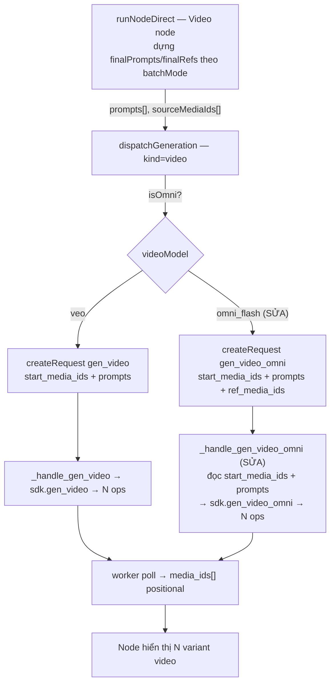

# Thiết kế — Sửa lỗi fan-out video Omni Flash (x3 chỉ ra 1 video)

## Overview

Khi nối một list 3 prompt + một list 3 ảnh vào Video node, chọn x3 và gen video bằng
**Omni Flash**, hệ thống chỉ tạo 1 video thay vì 3. Luồng ảnh (image) hoạt động đúng vì
nó đẩy đủ mảng `prompts` + `sourceMediaIds` xuống backend, còn luồng video Omni thì không.

Quá trình điều tra cho thấy fan-out của Omni Flash bị chặn ở **hai tầng**, không phải một:

| Tầng | File | Trạng thái |
|------|------|-----------|
| 1. Frontend dispatch | `frontend/src/store/generation.ts` — nhánh `if (isOmni)` (~dòng 1451–1481) | **Hỏng** — bỏ `opts.prompts` + `opts.sourceMediaIds`, gộp mọi ảnh vào một `ref_media_ids`, tạo 1 request |
| 2. Backend handler | `agent/flowboard/worker/processor.py` — `_handle_gen_video_omni` (~dòng 853) | **Hỏng** — không đọc `start_media_ids`/`prompts`, gọi SDK không kèm batch (comment dòng 850 ghi rõ "no multi-source batching") |
| 3. SDK | `agent/flowboard/services/flow_sdk.py` — `gen_video_omni` (~dòng 453) | **Sẵn sàng** — đã có vòng lặp `batch_sources` tạo 1 item/ảnh khi nhận `start_media_ids`/`prompts` |

So sánh với Veo (luồng đúng): frontend nhánh `else` đẩy `start_media_ids` + `prompts`,
backend `_handle_gen_video` đọc và truyền chúng cho SDK `gen_video`, SDK fan-out 1 op/ảnh.
Omni cần được làm "đối xứng" với Veo ở cả hai tầng frontend và backend handler.

Phần fan-out trong `runNodeDirect` (Video node, ~dòng 853–891) **đã đúng** — nó dựng
`finalPrompts`/`finalRefs` theo `batchMode` (zip/cross) và gọi `dispatchGeneration` với
`variantCount`, `prompts`, `sourceMediaIds`. Lỗi nằm ở chỗ `dispatchGeneration` (tầng 1)
và handler (tầng 2) làm rơi các mảng đó.

Bản sửa nhắm vào Yêu cầu 1 (Omni tôn trọng fan-out), Yêu cầu 2 (không regress single-input),
Yêu cầu 3 (giữ Veo + căn chỉnh slot).

## Architecture

Luồng dữ liệu mục tiêu sau khi sửa:



Nguyên tắc thiết kế: làm luồng Omni **đối xứng** với luồng Veo ở cả frontend và backend
handler, tận dụng khả năng batch sẵn có của SDK thay vì viết logic mới.

## Components and Interfaces

### Component 1 — Frontend: nhánh Omni trong `dispatchGeneration`

File: `frontend/src/store/generation.ts`, nhánh `if (isOmni)` (~dòng 1451–1481).

Hiện tại nhánh này: (1) gọi `getVideoNodeInputs(rfId)` để thu thập lại ingredient,
(2) tạo một request `gen_video_omni` với `prompt` đơn và `ref_media_ids = ingredients`,
(3) bỏ qua hoàn toàn `opts.prompts` và `opts.sourceMediaIds`.

Thiết kế sửa — phát hiện chế độ batch và đẩy mảng xuống, tương tự nhánh Veo:

- Tính `batchSources = Array.isArray(opts.sourceMediaIds) && opts.sourceMediaIds.length > 0 ? opts.sourceMediaIds : undefined`.
- Khi `batchSources` tồn tại (chế độ batch):
  - Thêm `start_media_ids: batchSources` vào params của `gen_video_omni`.
  - Khi `opts.prompts?.length > 0`, thêm `prompts: opts.prompts`.
  - Vẫn truyền `ref_media_ids` cho "ingredient dùng chung" (shared refs) nếu có — SDK hỗ
    trợ kết hợp `[start_image, *shared_refs]` cho mỗi item. Trong kịch bản x3 phổ biến
    (chỉ list ảnh nối vào start-image, không có ingredient riêng), `ref_media_ids` có thể
    rỗng; SDK chấp nhận khi `batch_sources` không rỗng.
- Khi **không** ở chế độ batch (`batchSources` undefined): giữ nguyên hành vi hiện tại
  (gộp `ingredients` vào `ref_media_ids`, một video) để không gây regress (Yêu cầu 2).
- Giữ nguyên validation "Omni Flash cần ít nhất một ingredient" cho trường hợp không batch.
  Với trường hợp batch, điều kiện hợp lệ là `batchSources` không rỗng.

Interface params gửi tới `createRequest({ type: "gen_video_omni", ... })` (bổ sung):

```ts
params: {
  prompt: string;              // prompt chia sẻ / fallback
  project_id: string;
  ref_media_ids: string[];     // shared ingredients (có thể rỗng khi batch thuần)
  duration_s: number;
  aspect_ratio: string;
  paygate_tier: string;
  start_media_ids?: string[];  // MỚI — danh sách ảnh nguồn cho batch
  prompts?: string[];          // MỚI — prompt theo từng variant
}
```

### Component 2 — Backend: `_handle_gen_video_omni`

File: `agent/flowboard/worker/processor.py`, `_handle_gen_video_omni` (~dòng 853).

Hiện tại handler chỉ đọc `ref_media_ids`, `prompt`, `duration_s` và gọi SDK không kèm
batch. Thiết kế sửa — làm đối xứng với `_handle_gen_video`:

- Đọc thêm `start_media_ids` (làm sạch như `_handle_gen_video`: lọc chuỗi non-empty, strip).
- Đọc thêm `prompts` (per-variant) tương tự `_handle_gen_video`.
- Điều chỉnh điều kiện hợp lệ: cho phép có `ref_media_ids` **hoặc** `start_media_ids` không
  rỗng (hiện bắt buộc `ref_media_ids`, sẽ chặn kịch bản batch thuần start-image).
- **Cross-project ref sync:** hàm hiện gọi `ensure_media_ids_in_project(ref_media_ids, ...)`.
  Cần sync **cả** `start_media_ids` (mỗi ảnh batch cũng phải tồn tại trong project Flow).
  Thiết kế: gộp tập id cần sync = `start_media_ids ∪ ref_media_ids`, gọi sync, rồi ánh xạ
  lại id đã sync về đúng vị trí trong `start_media_ids` và `ref_media_ids` trước khi dispatch.
  **Phải bảo toàn thứ tự `start_media_ids`** vì worker dùng chỉ số vị trí để căn
  `media_ids[i] ↔ source[i]`.
- Truyền `start_media_ids` (đã sync, đúng thứ tự) và `prompts` vào `sdk.gen_video_omni(...)`.
- Phần polling/tổng hợp đã trả về `media_ids` positional + `slot_errors` nên tự động hỗ trợ
  N op (đã đối xứng với `_handle_gen_video`), không cần đổi.
- Cập nhật comment ~847–852 vì khẳng định "no multi-source batching" không còn đúng.

### Component 3 — SDK `gen_video_omni` (không đổi logic)

File: `agent/flowboard/services/flow_sdk.py` (~dòng 453). Đã có sẵn nhánh `batch_sources`
tạo 1 item/ảnh, ghép `prompts[i]` và `referenceImages = [mid, *shared_refs]`, seed riêng mỗi
item. Chỉ cần handler truyền đúng `start_media_ids`/`prompts`. Có thể bổ sung test xác nhận.

### Component 4 — Hiển thị kết quả (placeholder + variant grid)

File: `frontend/src/store/generation.ts`, đầu `dispatchGeneration`.

- Mức kẹp `variantCount = Math.min(opts.variantCount ?? 1, 4)` cần nới cho luồng video batch
  để N ô placeholder khớp số op thực tế. Phương án: khi `kind === "video"` và
  `opts.sourceMediaIds.length > 1`, dùng `variantCount = opts.sourceMediaIds.length`
  (không kẹp ở 4), nhất quán với N `media_ids` backend trả về.
- Phần đọc kết quả video (ghi `mediaIds`, `slotErrors`, `variantCount`) đã dùng `media_ids`
  positional từ worker nên không cần đổi — N video tự hiển thị.

## Data Models

Không thêm bảng/model DB mới. Request lưu trong bảng `Request` với `type = "gen_video_omni"`
và `params` (JSON) như mô tả ở Component 1. Các trường mới `start_media_ids`, `prompts` là
tuỳ chọn, tương thích ngược (request cũ không có chúng vẫn chạy nhánh single-input).

Cấu trúc kết quả (result dict do handler trả về) giữ nguyên hợp đồng hiện có:

```python
{
  "media_ids": [Optional[str], ...],   # positional, dài N = số op
  "media_entries": [...],
  "slot_errors": [Optional[str], ...], # cùng chỉ số với media_ids
  "op_errors": {...},
  "duration_s": int,
}
```

## Correctness Properties

Các thuộc tính bất biến cần kiểm bằng property-based testing. Input sinh ngẫu nhiên:
số prompt `P ∈ [1..6]`, số ảnh `M ∈ [1..6]`, `batchMode ∈ {zip, cross}`.

### Property 1: Số lượng fan-out đúng (Omni, batch)
WHEN `videoModel = omni_flash` AND `P > 1` AND `M > 1`, số request item (op) Omni dispatch
bằng `min(P, M)` nếu `zip`, hoặc `P * M` nếu `cross` — bằng đúng độ dài `start_media_ids`
mà SDK nhận.

**Validates: Requirements 1.1, 1.4**

### Property 2: Ghép prompt↔ảnh chính xác
Với mọi vị trí `i`, item `i` của payload Omni có `textInput.text == per_item_prompts[i]` và
`referenceImages` chứa `finalRefs[i]` (kèm shared refs nếu có), khớp đúng cặp mà
`runNodeDirect` đã dựng.

**Validates: Requirements 1.2, 1.4**

### Property 3: Tương đương Veo↔Omni về số lượng
Với cùng `(P, M, batchMode)`, số op của Omni bằng số op của Veo. Fan-out không phụ thuộc
model.

**Validates: Requirements 1.1, 3.1**

### Property 4: Không regress single-input
WHEN `start_media_ids` rỗng/không có, Omni tạo đúng 1 item với `ref_media_ids` như trước
(gồm ca nhiều ingredient gộp vào 1 video).

**Validates: Requirements 2.1, 2.3**

### Property 5: Bảo toàn thứ tự qua sync
Sau cross-project sync trong handler, thứ tự `start_media_ids` giữ nguyên, nên `media_ids[i]`
luôn ứng với ảnh nguồn thứ `i` ban đầu.

**Validates: Requirements 1.3, 3.2**

### Property 6: Validation hợp lệ
Request Omni hợp lệ khi và chỉ khi `start_media_ids` không rỗng HOẶC `ref_media_ids` không
rỗng; rỗng cả hai → lỗi `missing_ref_media_ids`.

**Validates: Requirements 2.2**

## Error Handling

- **Thiếu nguồn:** rỗng cả `start_media_ids` lẫn `ref_media_ids` → trả `missing_ref_media_ids`
  (giữ mã lỗi hiện có, P6).
- **Sync thất bại:** nếu mọi id (gộp start + ref) fail sync → trả `sync_failed: <lý do>` như
  hiện tại. Nếu sync một phần, log cảnh báo và tiếp tục với các id thành công; tuy nhiên với
  `start_media_ids`, một ảnh nguồn fail sync nghĩa là **slot đó** không tạo được video — cần
  đảm bảo slot bị thiếu được phản ánh đúng (bỏ slot hoặc đánh dấu lỗi) mà không xô lệch thứ
  tự các slot còn lại.
- **Lỗi từng op (content filter / timeout):** đã xử lý ở vòng poll — mỗi op kết thúc độc lập,
  `slot_errors[i]` ghi lý do, batch một phần vẫn trả về các video thành công (giữ hợp đồng
  hiện có của `_handle_gen_video`).
- **Duration không hợp lệ:** giữ `invalid_duration_s` (chỉ 4/6/8/10).

## Testing Strategy

### Bug condition (kiểm thử thăm dò — kỳ vọng FAIL trên code chưa sửa)
- Mô phỏng dispatch Omni với `P=3, M=3, cross`: kỳ vọng 9 op (hoặc `zip` → 3 op). Code hiện
  tại chỉ ra 1 op → xác nhận bug tồn tại.

### Unit / integration
- **Frontend:** test `dispatchGeneration` nhánh Omni — params `gen_video_omni` chứa
  `start_media_ids`/`prompts` khi `opts.sourceMediaIds.length > 1`; và **không** chứa khi
  single-input (giữ `ref_media_ids`).
- **Backend:** test `_handle_gen_video_omni` — đọc `start_media_ids`/`prompts`, gọi SDK với
  đúng mảng; ca chỉ có `start_media_ids` (ref rỗng) vẫn hợp lệ; sync bảo toàn thứ tự.
- **SDK:** đã có path batch; bổ sung test khẳng định số item = `len(batch_sources)`.

### Property-based (PBT)
- Hiện thực P1–P6. Khung dự kiến: backend Python → `hypothesis`; frontend TS → `fast-check`.
  Sẽ chốt khung chính xác ở bước Tasks dựa trên cấu hình test hiện có của repo.

### Rủi ro & ghi chú triển khai
- **Cap số lượng:** SDK đặt `MAX_VARIANT_COUNT = 99`; cross dễ sinh số lớn (vd 6×6=36). Đề
  xuất giữ logic fan-out đúng nhưng thêm cảnh báo UI khi số op vượt ngưỡng (vd > 8) để tránh
  tốn credit ngoài ý muốn — làm rõ ở Tasks.
- **Bất đối xứng handle (ngoài phạm vi):** batch chỉ kích hoạt khi list ảnh nối vào handle
  `target-start-image`; nối vào `target-references` thì `hasBatchInputs = false` → vẫn 1 video.
  Đã ghi nhận ngoài phạm vi; chỉ xử lý nếu kiểm thử cho thấy nó chặn Yêu cầu 1.
- **Credit:** mỗi video Omni tốn credit theo thời lượng (`OMNI_FLASH_CREDIT_COST`); fan-out
  đúng nghĩa là chi phí nhân theo N — hành vi mong muốn nhưng UI cần thể hiện rõ.
