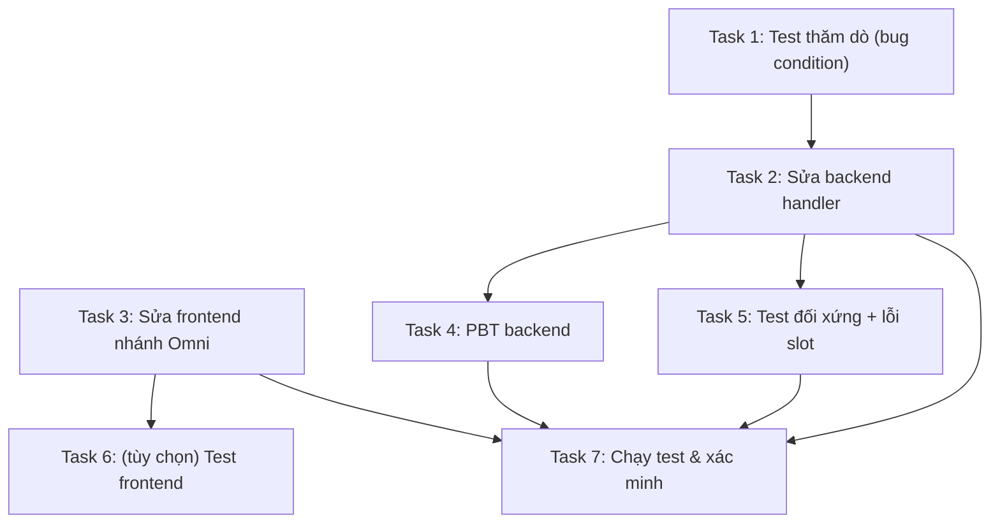

# Implementation Plan: Sửa lỗi fan-out video Omni Flash

## Overview

Kế hoạch sửa lỗi: Omni Flash chỉ tạo 1 video thay vì N khi nối list prompt + list ảnh và
chọn xN. Fan-out bị chặn ở hai tầng (frontend `dispatchGeneration` và backend handler
`_handle_gen_video_omni`); tầng SDK đã sẵn sàng. Trọng tâm sửa: làm luồng Omni đối xứng
với luồng Veo ở cả hai tầng, kèm property-based testing xác minh.

Ghi chú về kiểm thử:
- Backend (`flowboard/agent`) dùng `pytest` + `pytest-asyncio`, mock qua `RecordingClient`
  trong `tests/test_flow_sdk.py`; chưa có `hypothesis` (cần thêm vào `dev` deps cho PBT).
- Frontend (`flowboard/frontend`) hiện chưa có framework test (chỉ `lint = tsc`). PBT/đơn vị
  cho frontend cần thiết lập `vitest` + `fast-check` (Task 6, tùy chọn).
- Điểm collapse thực thi nằm ở backend handler, nên trọng tâm PBT đặt ở backend.

## Tasks

- [x] 1. Viết test thăm dò xác nhận bug (kỳ vọng FAIL trên code chưa sửa)
  - Tạo `agent/tests/test_omni_batch_fanout.py`.
  - Test mô phỏng `_handle_gen_video_omni` với `start_media_ids=["a","b","c"]` +
    `prompts=["p1","p2","p3"]` (mock SDK ghi lại tham số nhận được).
  - Khẳng định kỳ vọng đúng: SDK `gen_video_omni` phải nhận `start_media_ids` độ dài 3.
  - Trên code hiện tại test sẽ FAIL (handler không đọc/không truyền `start_media_ids`),
    qua đó xác nhận bug condition tồn tại.
  - _Properties: P1_
  - _Requirements: 1.1_

- [x] 2. Sửa backend handler `_handle_gen_video_omni` để hỗ trợ batch
  - File: `agent/flowboard/worker/processor.py`.
  - [x] 2.1 Đọc `start_media_ids` và `prompts` từ params (làm sạch giống `_handle_gen_video`:
    lọc chuỗi non-empty, strip; trả `None` nếu rỗng).
  - [x] 2.2 Nới điều kiện hợp lệ: cho phép có `ref_media_ids` HOẶC `start_media_ids` không
    rỗng; rỗng cả hai → giữ lỗi `missing_ref_media_ids`.
  - [x] 2.3 Sửa cross-project sync: gộp tập id cần sync = `start_media_ids ∪ ref_media_ids`,
    gọi `ensure_media_ids_in_project`, ánh xạ id đã sync về đúng vị trí — bảo toàn thứ tự
    `start_media_ids`.
  - [x] 2.4 Truyền `start_media_ids` (đã sync, đúng thứ tự) + `prompts` vào
    `sdk.gen_video_omni(...)`.
  - [x] 2.5 Cập nhật comment ~847–852 ("no multi-source batching" không còn đúng).
  - _Properties: P1, P5, P6_
  - _Requirements: 1.1, 1.3, 2.2_

- [x] 3. Sửa frontend nhánh Omni trong `dispatchGeneration`
  - File: `frontend/src/store/generation.ts`, nhánh `if (isOmni)` (~dòng 1451–1481).
  - [x] 3.1 Tính `batchSources` từ `opts.sourceMediaIds` (chỉ khi length > 0).
  - [x] 3.2 Khi có `batchSources`: thêm `start_media_ids: batchSources` và (nếu có)
    `prompts: opts.prompts` vào params `gen_video_omni`; vẫn truyền `ref_media_ids` cho
    shared ingredients nếu có.
  - [x] 3.3 Khi không batch: giữ nguyên đường gộp `ingredients → ref_media_ids` (1 video) và
    validation "cần ít nhất một ingredient" để không regress.
  - [x] 3.4 Nới mức kẹp `variantCount` ở đầu `dispatchGeneration` cho luồng video batch:
    khi `kind === "video"` và `opts.sourceMediaIds.length > 1`, dùng
    `variantCount = opts.sourceMediaIds.length` (không kẹp ở 4) để số ô placeholder khớp N.
  - _Properties: P2, P4_
  - _Requirements: 1.1, 1.2, 2.1, 2.3, 3.2_

- [x] 4. Thêm PBT backend cho fan-out Omni
  - [x] 4.1 Thêm `hypothesis` vào `[project.optional-dependencies].dev` trong
    `agent/pyproject.toml`.
  - [x] 4.2 Trong `agent/tests/test_omni_batch_fanout.py`, viết property test cho SDK
    `gen_video_omni` (dùng `RecordingClient`): với `start_media_ids` độ dài N và `prompts`
    sinh ngẫu nhiên, số item trong `body["requests"]` luôn bằng N, và `referenceImages` của
    item i chứa `start_media_ids[i]`.
    - _Properties: P1, P2_
  - [x] 4.3 Property test cho `_handle_gen_video_omni`: với input batch sinh ngẫu nhiên, SDK
    nhận đúng `start_media_ids` (số lượng + thứ tự) sau sync; với input single-input, SDK chỉ
    nhận `ref_media_ids` và đúng 1 item.
    - _Properties: P3, P4, P5_
  - [x] 4.4 Property test validation: rỗng cả `start_media_ids` lẫn `ref_media_ids` luôn trả
    `missing_ref_media_ids`; ngược lại không trả lỗi đó.
    - _Properties: P6_
  - _Requirements: 1.1, 1.2, 1.3, 2.1, 2.2, 2.3, 3.1, 3.2_

- [x] 5. Test đối xứng Veo↔Omni và xử lý lỗi từng slot
  - [x] 5.1 Test khẳng định: với cùng `start_media_ids` + `prompts`, số op của Omni bằng số
    op của Veo (so sánh `_handle_gen_video` và `_handle_gen_video_omni` qua mock SDK).
    - _Properties: P3_
  - [x] 5.2 Test một slot fail (sync fail hoặc content filter) không làm xô lệch thứ tự các
    slot còn lại; `slot_errors[i]` ghi đúng vị trí.
    - _Properties: P5_
  - _Requirements: 1.3, 3.1, 3.2_

- [x]* 6. (Tùy chọn) Thiết lập test frontend + test nhánh Omni
  - [x]* 6.1 Thêm `vitest` + `fast-check` vào `frontend/package.json` (devDependencies) và
    script `test`; cấu hình vitest tối thiểu.
  - [x]* 6.2 Test `dispatchGeneration` nhánh Omni: khi `opts.sourceMediaIds.length > 1`, params
    `gen_video_omni` chứa `start_media_ids`/`prompts`; khi single-input thì không (giữ
    `ref_media_ids`).
  - [x]* 6.3 Property test (fast-check) cho phần dựng `finalPrompts`/`finalRefs` trong
    `runNodeDirect`: số cặp = `min(P,M)` (zip) hoặc `P*M` (cross), ghép đúng vị trí.
  - _Properties: P1, P2, P4_
  - _Requirements: 1.1, 1.2, 1.4, 2.1_

- [x] 7. Chạy bộ test và xác minh
  - [x] 7.1 Chạy `pytest` cho `agent/tests/test_omni_batch_fanout.py` và các test liên quan
    (`test_flow_sdk.py`, `test_requests.py`) — toàn bộ phải PASS sau khi sửa.
  - [x] 7.2 Chạy `tsc -b --noEmit` (lint) frontend để đảm bảo không lỗi kiểu sau khi sửa
    `generation.ts`.
  - [x] 7.3 Xác nhận test thăm dò ở Task 1 nay đã PASS (bug đã được sửa).
  - _Requirements: 1.1, 1.2, 1.3, 2.1, 2.2, 2.3, 3.1, 3.2_

## Task Dependency Graph



```json
{
  "waves": [
    { "wave": 1, "tasks": ["1", "3"] },
    { "wave": 2, "tasks": ["2", "6"] },
    { "wave": 3, "tasks": ["4", "5"] },
    { "wave": 4, "tasks": ["7"] }
  ]
}
```

## Notes

- Task 1 là test thăm dò theo phương pháp bugfix: kỳ vọng FAIL trên code chưa sửa để xác
  nhận bug, sau khi sửa (Task 2) phải PASS (kiểm lại ở Task 7.3).
- Task 6 đánh dấu `*` (tùy chọn) vì frontend chưa có hạ tầng test; có thể bỏ qua nếu không
  muốn thêm `vitest`/`fast-check`. Bản sửa lõi (Task 2, 3) và PBT backend (Task 4) đã đủ
  bao phủ các thuộc tính P1–P6.
- Thứ tự khuyến nghị: Task 1 → 2 → 3 (sửa lõi), rồi 4, 5 (PBT/đối xứng), cuối cùng 7 (xác minh).
- Rủi ro số lượng lớn ở chế độ cross (vd 6×6=36 video) đã ghi ở design; nếu cần thêm cảnh báo
  UI sẽ mở task bổ sung sau, không nằm trong phạm vi sửa lỗi cốt lõi này.
