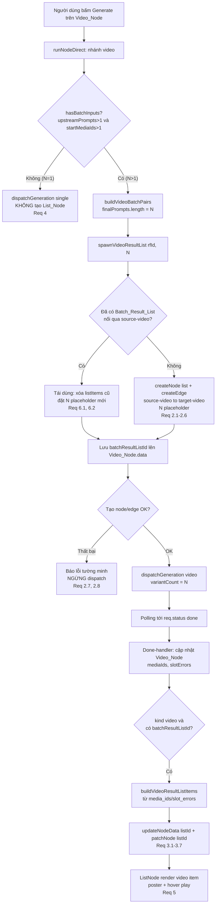

# Design Document

## Overview

Tính năng này thay đổi cách Flowboard hiển thị kết quả khi sinh video theo lô (batch). Thay vì hiển thị toàn bộ N video trong một lưới (grid) ngay trên Video_Node, hệ thống sẽ:

1. Ép Video_Node luôn dùng bố cục single-video, chỉ hiển thị video đầu tiên (giống Image_Node), nhưng vẫn lưu đủ N kết quả trong `mediaIds`.
2. Tạo tự động một List_Node (Batch_Result_List) **ngay tại thời điểm người dùng bấm Generate ở chế độ lô** (khi N > 1), nối edge `source-video → target-video`, và khởi tạo N ô placeholder giữ thứ tự.
3. Khi từng video render xong, đổ kết quả vào đúng ô theo thứ tự positional (prompt[i] ↔ video[i]), giữ nguyên vị trí cả với ô bị lỗi.
4. Nâng cấp List_Node để render và phát được video item (poster + hover-to-play) thay vì chỉ thumbnail tĩnh.

**Quyết định kiến trúc cốt lõi:** List_Node được tạo trong nhánh video của `runNodeDirect` (file `frontend/src/store/generation.ts`), ở **đúng nhánh `hasBatchInputs`** ngay trước khi gọi `dispatchGeneration`, tại thời điểm `finalPrompts.length` (= N) đã được biết chính xác. List_Node được tạo TRƯỚC khi dispatch để các ô placeholder hiển thị trạng thái chờ; kết quả được đổ vào SAU khi polling trả về `req.status === "done"` trong done-handler của `dispatchGeneration`.

Cách tiếp cận này tái dùng tối đa hạ tầng hiện có: `createNode`/`createEdge` (file `frontend/src/api/client.ts`), `updateNodeData`/`setNodes`/`setEdges` (file `frontend/src/store/board.ts`), `patchNode` để persist, và `nodeFromDto` để khôi phục sau reload. Toàn bộ thay đổi nằm ở frontend (`flowboard/frontend/src`). Không thêm bảng DB, không thay đổi giao kèo worker.

Tài liệu này không xử lý logic fan-out của Omni Flash (thuộc spec `video-batch-omni-fanout`); ở đây chỉ giả định cả hai model trả về cùng giao kèo positional `media_ids` / `slot_errors`.

## Architecture

### Luồng tổng thể



### Thứ tự thao tác theo thời gian

| Thời điểm | Hành động | Requirement |
|-----------|-----------|-------------|
| Khi bấm Generate, N > 1, TRƯỚC dispatch | Tạo (hoặc tái dùng) List_Node + edge, đặt N placeholder, lưu `batchResultListId` | 2.1-2.6, 6.1-6.3 |
| Khi bấm Generate, N = 1 | Không tạo gì, đi luồng single hiện có | 4.1-4.3 |
| Tạo node/edge thất bại | Báo lỗi, ngừng dispatch | 2.7, 2.8 |
| Sau khi tất cả N video done | Đổ N kết quả vào List_Node theo thứ tự positional | 3.1-3.7, 7.1-7.3 |
| Render | List_Node hiển thị video item phát được | 5.1-5.7 |
| Reload | `nodeFromDto` khôi phục node + edge + listItems | 8.6 |

### Các điểm chèn mã (đã khảo sát, không bịa)

- **Tạo List_Node:** `frontend/src/store/generation.ts`, nhánh `if (hasBatchInputs)` (~dòng 899-919), chèn lời gọi `spawnVideoResultList` ngay trước `await get().dispatchGeneration(...)`.
- **Đổ kết quả:** `frontend/src/store/generation.ts`, done-handler trong `dispatchGeneration` (~dòng 1698-1803), chèn nhánh `kind === "video" && batchResultListId` ngay sau `patchNode(dbId, ...)` của node gốc (~dòng 1802), trước khối auto-spawn image (`opts.kind === "image"`, ~dòng 1803).
- **Single-video layout:** `frontend/src/canvas/v2/VideoGeneratorNode.tsx`, biến `showVariantGrid` (~dòng 309).
- **Render video item:** `frontend/src/canvas/v2/ListNode.tsx`, khu grid media (~dòng 584-655) và list media (~dòng 659-748).

## Components and Interfaces

### (a) Helper `spawnVideoResultList` (mới, trong `generation.ts`)

Tách phần thao tác I/O (gọi API, cập nhật store) ra khỏi phần logic thuần (dựng placeholder) để test được. Logic thuần đặt vào `buildPlaceholderListItems` (xem mục Testing Strategy).

```ts
/**
 * Tạo (hoặc tái dùng) Batch_Result_List cho một lần sinh video theo lô.
 * Gọi NGAY TRƯỚC dispatchGeneration trong nhánh hasBatchInputs.
 * Trả về rfId (string) của list node để done-handler biết đổ kết quả vào đâu,
 * hoặc throw nếu tạo node/edge thất bại (để caller ngừng dispatch).
 */
async function spawnVideoResultList(
  videoRfId: string,
  count: number,                 // N = finalPrompts.length
  titles: string[],              // tiêu đề placeholder theo thứ tự (vd "Video 1".."Video N")
): Promise<string>;              // rfId của Batch_Result_List
```

Hành vi:

1. Đọc `boardId`, `nodes`, `edges` từ `useBoardStore.getState()`. Nếu `boardId === null` → throw.
2. **Reuse (Req 6.1):** tìm edge `e` có `e.source === videoRfId && e.sourceHandle === "source-video"` mà `e.target` trỏ tới một node type `list`. Nếu tìm thấy → đây là Batch_Result_List hiện có; bỏ qua bước tạo node/edge, chuyển sang bước 5 với `listRfId = e.target`.
3. **Tạo mới (Req 2.1, 2.3, 2.4):** gọi `createNode({ board_id, type: "list", x, y, data })` với `x/y` đặt cạnh Video_Node (`videoNode.position.x + DEFAULT_WIDTH + GAP`, cùng `y`). `data` khởi tạo gồm `{ type: "list", title, lockedType: "video", listIntakeMode: "replace", status: "running", ...placeholderData }`.
4. **Tạo edge (Req 2.4):** gọi `createEdge({ board_id, source_id: videoDbId, target_id: listDbId, kind: "video", source_handle: "source-video", target_handle: "target-video" })`. **Phải truyền tường minh** `source_handle`/`target_handle` vì `createEdge` mặc định `source_handle = "source"`. Append vào store qua `setEdges`/`setNodes` (theo pattern `edgeFromDto` + đảm bảo `sourceHandle`/`targetHandle` được gán).
5. **Đặt N placeholder (Req 2.2, 6.2):** dựng `placeholderData = buildPlaceholderListItems(count, titles)` rồi `updateNodeData(listRfId, placeholderData)` (tức thì cho UI) + `patchNode(listDbId, { status: "running", data: placeholderData })` (persist, Req 2.5). Khi reuse, placeholder mới **thay thế** toàn bộ listItems cũ.
6. Trả về `listRfId`.

`buildPlaceholderListItems(count, titles)` (logic thuần, testable) trả về:

```ts
{
  listItems: Array<{ id, kind: "video", title, mediaId: null, flowMediaId: null,
                     mediaUrl: null, mime: "video/mp4", status: "pending" }>, // length === count
  listSelectedIndexes: [],
  mediaIds: [],           // chưa có kết quả
  flowMediaIds: [],
  variantCount: count,
}
```

### (b) Sửa nhánh video của `runNodeDirect`

Trong `frontend/src/store/generation.ts`, nhánh `if (hasBatchInputs)` (~dòng 899):

```ts
if (hasBatchInputs) {
  const { prompts: finalPrompts, refs: finalRefs } =
    buildVideoBatchPairs(upstreamPrompts, startMediaIds, batchMode);
  const formattedPrompts = cameraInstruction
    ? finalPrompts.map((p) => `${p}. ${cameraInstruction}`)
    : finalPrompts;

  // MỚI: tạo/tái dùng Batch_Result_List TRƯỚC khi dispatch (Req 2.1, 2.6).
  let batchResultListId: string;
  try {
    const titles = formattedPrompts.map((_, i) => `Video ${i + 1}`);
    batchResultListId = await spawnVideoResultList(rfId, formattedPrompts.length, titles);
  } catch (err) {
    // Req 2.7, 2.8: báo lỗi tường minh + ngừng dispatch.
    useBoardStore.getState().updateNodeData(rfId, {
      status: "error",
      error: "Không tạo được danh sách kết quả (Batch Result List). Đã hủy lần sinh.",
    });
    return; // KHÔNG dispatch.
  }

  // Ghi nhớ list đích để done-handler đổ kết quả (mục c).
  useBoardStore.getState().updateNodeData(rfId, { batchResultListId });

  await get().dispatchGeneration(rfId, {
    prompt: formattedPrompts[0],
    kind: "video",
    aspectRatio,
    variantCount: formattedPrompts.length,
    prompts: formattedPrompts,
    sourceMediaIds: finalRefs,
  });
  return;
}
```

`batchResultListId` được lưu trên `node.data` của Video_Node (in-memory đủ cho session; cũng được persist trong placeholder patch để done-handler sau reload-trong-phiên vẫn đọc được).

### (c) Done-handler đổ kết quả (trong `dispatchGeneration`)

Trong done-handler (~sau dòng 1802, trước khối auto-spawn image), thêm nhánh:

```ts
const rootNodeNow = useBoardStore.getState().nodes.find((x) => x.id === rfId);
const batchResultListId = rootNodeNow?.data.batchResultListId as string | undefined;

if ((opts.kind ?? "image") === "video" && batchResultListId) {
  const listData = buildVideoResultListItems({
    mediaIds,        // media_urls hoặc media_ids (positional, có thể null)
    flowMediaIds,    // media_ids
    assetIds,
    slotErrors,      // slot_errors (positional, có thể null)
    prompts: opts.prompts ?? [opts.prompt],
  });
  useBoardStore.getState().updateNodeData(batchResultListId, {
    status: "done", ...listData, renderedAt,
  });
  const listDbId = parseInt(batchResultListId, 10);
  if (!isNaN(listDbId)) {
    patchNode(listDbId, { status: "done", data: { ...listData, renderedAt } })
      .catch(() => { /* non-fatal cho session */ });
  }
}
```

`buildVideoResultListItems` (logic thuần, testable) chuyển mảng positional thành `listItems` đầy đủ:

```ts
function buildVideoResultListItems(input: {
  mediaIds: (string | null)[];
  flowMediaIds: (string | null)[];
  assetIds: (string | null)[];
  slotErrors: (string | null)[] | null;
  prompts: string[];
}): {
  listItems: Array<Record<string, unknown>>;   // length === mediaIds.length, GIỮ thứ tự
  listSelectedIndexes: number[];
  mediaIds: string[];        // chỉ các slot thành công (cho downstream)
  flowMediaIds: string[];
  variantCount: number;      // === input.mediaIds.length
};
```

Quy tắc:

- Lặp theo index `i` của mảng positional; **không filter trước khi dựng listItems** để giữ căn chỉnh slot[i] ↔ prompt[i] (Req 3.1, 3.2).
- Nếu `mediaIds[i]` null hoặc `slotErrors[i]` không null → tạo item `{ kind: "video", status: "error", error: slotErrors[i], mediaId: null, title }` (Req 3.3, 3.4). KHÔNG bỏ qua, KHÔNG dịch các slot khác.
- Nếu thành công → `{ id, kind: "video", mediaId, flowMediaId, mediaUrl, mime: "video/mp4", title, status: "done" }` (Req 3.5). `id` phải unique (ưu tiên `flowMediaId ?? mediaId ?? video-slot-${i}`) để hợp với `normalizeListItemRecord`/dedupe.
- `listItems.length` luôn bằng `mediaIds.length` (Req 3.5, 3.6); danh sách không rỗng khi N > 0 (Req 3.7).
- `mediaIds`/`flowMediaIds` trả về chỉ chứa các slot thành công (phục vụ downstream và intake re-run); `variantCount` luôn = N để UI hiển thị đủ số ô.

### (d) Reuse Batch_Result_List (Req 6)

Đã mô tả ở `spawnVideoResultList` bước 2: dò edge `source-video` từ Video_Node tới một list node. Nếu có → tái dùng (thay placeholder), không tạo trùng. Nếu không → tạo mới (Req 6.3). Việc "xóa listItems cũ rồi đặt N placeholder mới" được đảm bảo do `buildPlaceholderListItems` trả về mảng mới và `updateNodeData`/`patchNode` ghi đè field `listItems` (merge cấp 1, thay nguyên mảng).

### (e) `VideoGeneratorNode.tsx` — ép single-video layout (Req 1)

Đổi (~dòng 309):

```ts
// Trước:
const showVariantGrid = mediaIds.length > 1;
// Sau (Req 1.1, 1.2, 1.5): node video luôn dùng bố cục single-video,
// chỉ hiển thị video đầu (mediaIds[0]/mediaId), giống ImageGeneratorNode.
const showVariantGrid = false;
```

Hệ quả:
- `visibleSlots` = 1; khối render grid (`showVariantGrid ? ...`) không bao giờ chạy.
- useEffect hover-play (~dòng 324-337) đang gate bằng `!showVariantGrid` → giờ luôn active cho `mediaId` (Req 1.4 giữ nguyên hành vi preview hover/selected).
- `mediaIds` vẫn được lưu đủ N trong `node.data` qua done-handler (Req 1.3) — chỉ UI hiển thị cái đầu; List_Node và downstream vẫn truy cập đủ N.

### (f) `ListNode.tsx` — nâng cấp render video item (Req 5)

Ở cả grid view (~dòng 584-655) và list view (~dòng 659-748), nhánh `isItemVideo` hiện dùng `` + badge `<Video>`. Tách thành một component con `VideoListThumb`:

```tsx
function VideoListThumb({ src, poster, fit }: { src: string; poster?: string; fit: "cover" | "contain" }) {
  const ref = useRef<HTMLVideoElement>(null);
  const [playing, setPlaying] = useState(false);
  const onEnter = () => { ref.current?.play().then(() => setPlaying(true)).catch(() => {}); };
  const onLeave = () => {
    // Req 5.5: chỉ dừng/đặt lại poster KHI đang phát.
    if (!playing) return;
    const el = ref.current; if (!el) return;
    el.pause(); el.currentTime = 0; setPlaying(false);
  };
  return (
    <video ref={ref} src={src} poster={poster} muted loop playsInline preload="metadata"
           onMouseEnter={onEnter} onMouseLeave={onLeave} /* ... */ />
  );
}
```

- Req 5.1: dùng `<video>` thay `` cho item `kind === "video"`.
- Req 5.2: thuộc tính `poster` (hoặc `preload="metadata"` để hiện khung hình đầu) làm poster trước khi phát.
- Req 5.3: `onMouseEnter` → `play()`.
- Req 5.4: `onMouseLeave` khi đang phát → `pause()` + `currentTime = 0` (về poster).
- Req 5.5: `onMouseLeave` khi KHÔNG phát → no-op.
- Req 5.6: giữ badge `<Video>` overlay.
- Req 5.7: giữ `onDoubleClick → openResultViewer(rfId, idx)` ở phần tử bao ngoài (không đổi).

Slot lỗi (`status === "error"`, `mediaId === null`) render khung báo lỗi thay vì video (Req 3.4).

## Data Models

Không thêm bảng DB. Chỉ mở rộng `node.data` (JSON column, persist qua `patchNode`, khôi phục qua `nodeFromDto` spread `...d`).

### Field mới trên `Video_Node.data`

| Field | Kiểu | Ý nghĩa |
|-------|------|---------|
| `batchResultListId` | `string \| undefined` | rfId của Batch_Result_List được tạo/tái dùng cho lần sinh lô hiện tại. Done-handler đọc field này để biết đổ kết quả vào đâu. Dùng để dò reuse ở lần sinh sau (kết hợp với edge `source-video`). |

### List_Item cho video (trong `Batch_Result_List.data.listItems`)

Tương thích `normalizeListItemRecord` (generation.ts ~138-166) và render của `ListNode`:

```ts
type VideoListItem = {
  id: string;            // unique: flowMediaId ?? mediaId ?? `video-slot-${i}`
  kind: "video";
  title: string;         // "Video {i+1}"
  text: null;
  mediaId: string | null;     // null khi slot lỗi/placeholder
  flowMediaId: string | null;
  mediaUrl: string | null;
  imageUrl: null;
  mime: "video/mp4";
  width: number | null;
  height: number | null;
  duration: number | null;
  status: "pending" | "done" | "error";  // pending=placeholder, error=slot lỗi
  error?: string | null;       // thông điệp từ slot_errors[i] khi status==="error"
};
```

### Trạng thái `Batch_Result_List.data` theo vòng đời

| Giai đoạn | `status` | `listItems` | `mediaIds` | `variantCount` |
|-----------|----------|-------------|------------|----------------|
| Vừa tạo (placeholder) | `"running"` | N item `status:"pending"`, `mediaId:null` | `[]` | N |
| Sau khi done | `"done"` | N item (done/error), giữ thứ tự | chỉ slot thành công | N |

`listSelectedIndexes` để `[]` ở cả hai giai đoạn (không tự chọn). Edge giữa Video_Node và List_Node có `kind: "video"`, `source_handle: "source-video"`, `target_handle: "target-video"`.

## Correctness Properties

*Một property là đặc tính hoặc hành vi phải đúng trên mọi lần thực thi hợp lệ của hệ thống — về bản chất là một phát biểu hình thức về điều phần mềm phải làm. Property là cầu nối giữa đặc tả dạng ngôn ngữ tự nhiên và sự đảm bảo đúng đắn có thể kiểm chứng bằng máy.*

Các property dưới đây được rút ra từ phần prework và tập trung vào lớp logic thuần đã tách (`buildPlaceholderListItems`, `buildVideoResultListItems`) cùng logic dò reuse, để có thể kiểm thử bằng property-based testing độc lập với React/DOM.

### Property 1: Số ô placeholder và số List_Item bằng N

*For all* số nguyên N ≥ 1 và danh sách `mediaIds`/`slotErrors` positional có độ dài N, `buildPlaceholderListItems(N, ...)` trả về đúng N item, và `buildVideoResultListItems` trả về `listItems` có đúng N phần tử với `variantCount === N`.

**Validates: Requirements 2.2, 3.5, 3.6**

### Property 2: Căn chỉnh thứ tự slot[i] ↔ video[i] ↔ prompt[i]

*For all* mảng positional `mediaIds`/`flowMediaIds`/`prompts` cùng độ dài N, với mọi chỉ số i mà `mediaIds[i]` không null thì `listItems[i]` có `kind === "video"`, `mediaId === mediaIds[i]`, và `title` ứng với `prompts[i]` (vị trí i), không bị dịch chuyển.

**Validates: Requirements 3.1, 3.2, 3.5**

### Property 3: Slot lỗi giữ nguyên vị trí, không xô lệch

*For all* mảng positional có một tập chỉ số lỗi bất kỳ (phần tử `mediaIds[i]` null hoặc `slotErrors[i]` không null), `buildVideoResultListItems` giữ `listItems` đúng độ dài N, đặt item tại đúng các chỉ số lỗi đó với `status === "error"`, và mọi slot thành công vẫn ở đúng chỉ số gốc của nó.

**Validates: Requirements 3.3, 3.4**

### Property 4: Danh sách kết quả không rỗng và đầy đủ khi N ≥ 1

*For all* mảng positional độ dài N ≥ 1 (kể cả khi mọi/ một số slot lỗi), `buildVideoResultListItems` trả về `listItems` không rỗng và có đúng N item, đảm bảo người dùng luôn truy cập được toàn bộ kết quả dù phân loại từng item có vấn đề.

**Validates: Requirements 3.6, 3.7**

### Property 5: N = 1 không sinh ra Batch_Result_List

*For all* cấu hình đầu vào dẫn tới N = 1 (không thỏa `hasBatchInputs`), logic quyết định tạo list trả về "không tạo": không có lời gọi tạo node/edge và `batchResultListId` không được đặt.

**Validates: Requirements 4.2, 4.3**

### Property 6: Reuse thay vì tạo trùng

*For all* tập edge của board, hàm dò reuse trả về đúng một list node hiện có khi (và chỉ khi) tồn tại edge từ Video_Node qua handle `source-video` tới một node `list`; khi tồn tại, logic chọn "tái dùng" (không tạo node mới), ngược lại chọn "tạo mới".

**Validates: Requirements 6.1, 6.3**

### Property 7: Độc lập với Video_Model (Veo và Omni Flash)

*For all* giá trị `videoModel ∈ {veo, omni_flash}` và cùng một bộ mảng positional `media_ids`/`slot_errors` đầu vào, `buildVideoResultListItems` cho ra `listItems` giống hệt nhau — kết quả chỉ phụ thuộc giao kèo positional, không phụ thuộc model.

**Validates: Requirements 7.1, 7.2, 7.3**

### Property 8: Placeholder được thay thế hoàn toàn khi tái dùng

*For all* trạng thái `listItems` cũ bất kỳ và số N mới, dữ liệu placeholder mới do `buildPlaceholderListItems(N, ...)` tạo có đúng N item và không chứa phần tử nào của `listItems` cũ (thay thế hoàn toàn, không nối thêm).

**Validates: Requirements 6.2**

## Error Handling

| Tình huống | Xử lý | Requirement |
|-----------|-------|-------------|
| `createNode`/`createEdge` cho Batch_Result_List thất bại | `spawnVideoResultList` throw; caller bắt lỗi, set `Video_Node.data` `{ status: "error", error: <thông điệp tường minh> }`, và `return` để **không** gọi `dispatchGeneration` | 2.7, 2.8 |
| `boardId === null` lúc spawn | Coi như thất bại tạo node → cùng nhánh lỗi trên | 2.7, 2.8 |
| `patchNode` (persist placeholder hoặc kết quả) thất bại | Non-fatal trong session: `.catch(() => {})`; store in-memory vẫn đúng. Sau reload có thể mất placeholder chưa kịp persist nhưng không chặn luồng | 2.5 |
| Slot lỗi (`media_ids[i]` null hoặc `slot_errors[i]` không null) | Item tại i mang `status:"error"` + `error: slot_errors[i]`; List_Node render chỉ báo lỗi cho đúng ô, các ô khác không dịch | 3.3, 3.4 |
| Một/nhiều item phân loại lỗi | `buildVideoResultListItems` vẫn trả đủ N item, danh sách không rỗng (fallback `kind:"video"` + title theo index) | 3.6, 3.7 |
| Intake filter cho `source-video` sẽ không nhận được item | Ngăn thiết lập kết nối đó (validation lúc connect) để tránh edge "chết" | 8.5 |
| `mediaId` rỗng ở done-handler node gốc | Khối persist node gốc đã guard `if (!isNaN(dbId) && mediaId)`; nhánh đổ list chạy độc lập dựa trên `batchResultListId` và mảng positional | 3.x |

Thông điệp lỗi hiển thị cho người dùng phải tường minh (ví dụ: "Không tạo được danh sách kết quả (Batch Result List). Đã hủy lần sinh."), không âm thầm bỏ qua (Req 2.7).

## Testing Strategy

PBT áp dụng được cho tính năng này vì phần lõi là **logic thuần biến đổi dữ liệu**: dựng placeholder, dựng `listItems` từ mảng positional, dò reuse. Các hàm này được tách khỏi I/O và React (giống cách `buildVideoBatchPairs` đã được tách và test trong `frontend/src/store/__tests__/videoBatch.test.ts`), nên kiểm thử được độc lập.

### Hạ tầng

- **Runner:** Vitest (đã có trong `frontend`).
- **PBT library:** `fast-check` (đã có; xem `videoBatch.test.ts`). Không tự cài đặt PBT từ đầu.
- **Component test (ListNode):** `@testing-library/react` cho render và tương tác hover/double-click (mock `<video>` play/pause).

### Tách hàm để test (bắt buộc)

Để các property kiểm thử được, tách 3 hàm thuần khỏi `generation.ts` và export:

- `buildPlaceholderListItems(count, titles)` — dựng N placeholder.
- `buildVideoResultListItems(input)` — dựng listItems từ mảng positional.
- `findReusableVideoResultList(edges, videoRfId, nodes)` — trả về rfId list node tái dùng được hoặc `null`.

### Property tests (tối thiểu 100 iterations mỗi property)

Mỗi test chạy tối thiểu 100 vòng (`fc.assert(fc.property(...), { numRuns: 100 })`) và gắn tag tham chiếu property thiết kế. Định dạng tag:

`// Feature: video-batch-result-list, Property {N}: {nội dung property}`

| Test | Property | Generators |
|------|----------|-----------|
| Số ô = N | Property 1 | `fc.integer({min:1,max:50})` cho N; mảng id ngẫu nhiên độ dài N |
| Căn chỉnh slot ↔ video ↔ prompt | Property 2 | mảng `mediaIds`/`prompts` cùng độ dài, id ngẫu nhiên |
| Slot lỗi giữ vị trí | Property 3 | mảng có tập chỉ số null/`slot_errors` ngẫu nhiên |
| Không rỗng, đủ N | Property 4 | mảng độ dài N ≥ 1, gồm cả trường hợp toàn lỗi |
| N=1 không tạo list | Property 5 | sinh `upstreamPrompts`/`startMediaIds` sao cho `hasBatchInputs` false |
| Reuse vs tạo mới | Property 6 | tập edge ngẫu nhiên có/không edge `source-video` tới `list` |
| Độc lập model | Property 7 | `fc.constantFrom("veo","omni_flash")` + cùng mảng positional |
| Placeholder thay thế hoàn toàn | Property 8 | `listItems` cũ ngẫu nhiên + N mới |

### Unit tests (ví dụ cụ thể, edge case)

- `buildVideoResultListItems`: ví dụ N=3 toàn thành công; ví dụ slot giữa lỗi (`[id0, null, id2]` + `slot_errors=[null, "blocked", null]`) → item[1] `status:"error"`, item[0]/item[2] đúng vị trí.
- `buildPlaceholderListItems`: N=1 (biên dưới khi gọi nội bộ), N lớn; tất cả `mediaId:null`, `status:"pending"`.
- `findReusableVideoResultList`: có edge `source-video`→list (reuse), có edge `source-video`→non-list (không reuse), không có edge (tạo mới).

### Component tests (ListNode video item — Req 5)

Không dùng PBT (UI render); dùng example-based:

- Item `kind:"video"` render `<video>` (không phải ``) với `poster`/`preload` (Req 5.1, 5.2).
- `mouseEnter` gọi `play()` (Req 5.3); `mouseLeave` khi đang phát gọi `pause()` + reset `currentTime` (Req 5.4); `mouseLeave` khi chưa phát → không gọi `pause()` (Req 5.5).
- Badge `<Video>` vẫn hiển thị (Req 5.6); `doubleClick` gọi `openResultViewer` (Req 5.7).

### Integration / regression (Req 8)

- Sinh ảnh theo lô vẫn spawn `add_reference` như cũ, không bị ảnh hưởng (Req 8.1).
- Video_Node giữ đủ các handle hiện có (Req 8.2) — snapshot danh sách handle.
- Reload board sau khi tạo Batch_Result_List: `getBoard` → `nodeFromDto`/`edgeFromDto` khôi phục Video_Node, List_Node, edge, và listItems (Req 8.6).
- Single-video (N=1): không tạo list, hiển thị 1 video (Req 4.1-4.3).

### Cân bằng

Property tests phủ logic dựng/căn chỉnh/lỗi/reuse trên nhiều đầu vào; unit tests ghim ví dụ và edge case cụ thể; component và integration tests phủ UI và chống hồi quy. Tránh viết quá nhiều unit test trùng vùng đã được property test phủ.
