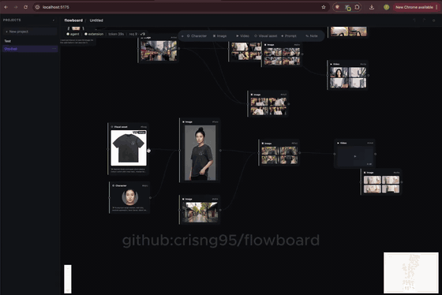
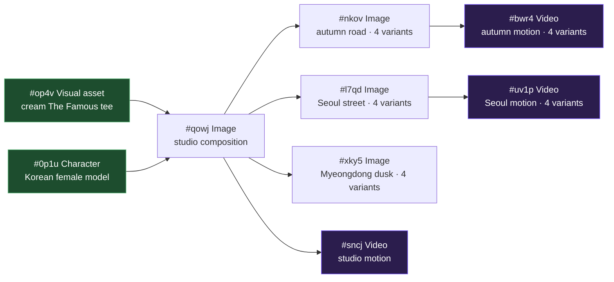

<p align="center">
  
</p>

<p align="center">
  <a href="#license"></a>
  
  
  
  
  
  
  
  
  
  
  
  
</p>

---

> ### ✅ Fixed for the new Google Flow API
>
> Google moved Flow to **`flow.google.com`** in September 2026 and rewrote the
> frontend. The REST API Flowboard called (`aisandbox-pa.googleapis.com` with a
> sniffed `Bearer ya29.…`) no longer has a caller, and that token is not
> expired — it stopped being minted. Everything now goes through Flow's
> `batchexecute` endpoint, signed inside the page by the extension.
>
> **Already running an older Flowboard?** → [**Upgrading from a
> pre-migration install**](#upgrading-from-a-pre-migration-install) — three
> steps, about two minutes.
> **New here?** → [Quickstart](#quickstart). **What changed?** →
> [Changelog](#changelog) · [migration notes](docs/migrations/flow-batchexecute.md).

---

<p align="center">
  <b>A local-only, single-user infinite-canvas workspace for AI media workflows.</b><br/>
  Compose characters, products, scenes, and videos as a directed graph. Drive generation through a Chrome extension that proxies requests to Google Flow (Veo 3.1 / GEM_PIX_2).<br/>
  Every node is reusable, every edge is a real data-dependency, every variant is independently regenerable.
</p>

> **⚠ Hard requirements — read this before cloning:**
>
> 1. **Google Flow plan: `Pro` or `Ultra` only.** Veo 3.1 i2v + GEM_PIX_2
>    are gated to paid tiers. The free tier and trial accounts cannot
>    drive video generation, so Flowboard cannot work on them. Confirm
>    your plan at [flow.google.com](https://flow.google.com/) before
>    installing.
> 2. **Chrome extension is mandatory, and so is an open Flow tab.** Flow
>    signs every call inside the page — session cookie, per-page token,
>    single-use reCAPTCHA — so the agent has no path to it at all. The
>    extension runs each request in a signed-in `flow.google.com` tab on
>    the agent's behalf. Without it loaded and one such tab open, the
>    `▶ Generate` button does nothing. Nothing here runs headless.
> 3. **One LLM CLI on `PATH` for auto-prompt / vision / planner.**
>    Flowboard ships a swappable provider layer — pick one in
>    `Settings → AI Providers`:
>
>    - **Claude Code** (default, recommended) —
>      [`@anthropic-ai/claude-code`](https://docs.claude.com/claude-code/install) ·
>      OAuth via your Claude subscription · fully tested in production.
>    - **Gemini** — the Antigravity CLI (`agy`) on `PATH` · OAuth via
>      Google AI · tested live. Google's old `@google/gemini-cli` is
>      **dead** for individual Code Assist tiers (every call returns
>      `IneligibleTierError`), so this provider drives `agy` instead.
>      The provider is still called `gemini` everywhere in the config
>      and API — only the binary changed. Self-updates via `agy update`.
>    - **OpenAI Codex** —
>      [`@openai/codex`](https://github.com/openai/codex) · OAuth via
>      ChatGPT Plus/Pro · tested live.
>
>    Flowboard does not call any cloud LLM API directly — every
>    auto-prompt / vision / planner round-trip shells out to the CLI
>    you've connected, so the cost lives on your existing AI
>    subscription.

<p align="center">
  <a href="#why">Why</a> ·
  <a href="#showcase">Showcase</a> ·
  <a href="#how-it-works">How it works</a> ·
  <a href="#architecture">Architecture</a> ·
  <a href="#quickstart">Quickstart</a> ·
  <a href="#features">Features</a>
</p>

---

## Demo

<p align="center">
  <a href="docs/assets/flowboard-intro.mp4">
    
  </a><br/>
  <sub>End-to-end walkthrough — refs → composed image → multi-source i2v. Click for full-quality MP4.</sub>
</p>

---

## Why

E-commerce video creative is repetitive: same model, same product, many
scenes, many short clips. Building it by hand in a generic Veo / Imagen UI
means re-uploading the same character ref every time, re-typing the same
"young Korean woman in the cream cropped tee" prompt every time, and
losing track of which 4-variant generation came from which source still.

Flowboard treats the workflow as a graph:

- **Refs are nodes** — upload a character once, upload a product once.
- **Composed shots are nodes** — `(Character) + (Product) → Image`.
- **Videos are nodes** — `(Image) → Video` via i2v, with multi-source batch
  so a 4-variant image spawns 4 videos in one click.
- **Prompts are auto-synthesised** from upstream context (the configured
  LLM CLI's vision pass describes each ref → a downstream generator
  gets the brief spliced into a fashion-editorial prompt). Switch
  provider in `Settings → AI Providers`; defaults to Claude Code.

The result: one source-of-truth canvas for an entire campaign.

---

## Showcase

The graph below is a real export from a board in this project — two ref
nodes (`#op4v` product, `#0p1u` model) feeding three scene compositions
and three downstream videos. Every image and clip below was rendered by
the pipeline in this repo.

<p align="center">
  <br/>
  <sub>The actual canvas in the app: 2 refs (left) → studio composition <code>#qowj</code> (centre) → scene-variant images (autumn / Seoul / Myeongdong) → 3 video nodes with 4-up i2v variant grids (right).</sub>
</p>



### Layer 0 — references (one-time setup)

<table>
<tr>
<td align="center" width="50%">
  <br/>
  <sub><b>#op4v · Visual asset</b><br/>Cropped boxy short-sleeve tee in cream ribbed cotton with brown "The Famous" centre-chest embroidery.</sub>
</td>
<td align="center" width="50%">
  <br/>
  <sub><b>#0p1u · Character</b><br/>Studio portrait headshot, neutral closed-mouth expression — generated from gender + nationality presets, anchored for downstream identity consistency.</sub>
</td>
</tr>
</table>

### Layer 1 — composed studio shot

<p align="center">
  <br/>
  <sub><b>#qowj · Image</b> — auto-prompt from upstream briefs: "Editorial photo, model engaging the camera with direct eye contact, both hands tucked in pockets, knees-up framing, neutral studio backdrop." 4 pose-distinct variants generated in one batch.</sub>
</p>

### Layer 2 — environment-aware variants

The synth detects scene context from each new image's brief and switches
motion vocabulary (street / studio / café / outdoor). Same character + same
product, three different worlds:

<table>
<tr>
<td align="center" width="33%">
  <br/>
  <sub><b>#nkov</b> · autumn mountain road, traditional Korean pavilion, red maple foliage</sub>
</td>
<td align="center" width="33%">
  <br/>
  <sub><b>#l7qd</b> · Seoul street, food stalls, Korean signage</sub>
</td>
<td align="center" width="33%">
  <br/>
  <sub><b>#xky5</b> · Myeongdong dusk, red-canopied stalls, Olive Young signage</sub>
</td>
</tr>
</table>

### Layer 3 — image-to-video (Veo 3.1 i2v)

Camera is locked-off (e-commerce default — keeps the product fully framed
the whole clip); the model performs a **time-coded 2–3 beat editorial
pose-shift** within the 8 seconds. (GitHub renders MP4 inline only when
hosted on its CDN, so we ship looping GIFs in the README — full-quality
MP4s live in [`docs/assets/`](docs/assets/).)

<table>
<tr>
<td align="center" width="33%">
  <br/>
  <sub><b>#sncj</b> · studio motion · half-step → glance → hair-tuck<br/><a href="docs/assets/video-base.mp4">▶ MP4</a></sub>
</td>
<td align="center" width="33%">
  <br/>
  <sub><b>#bwr4</b> · autumn road · pivot → pocket → camera smirk<br/><a href="docs/assets/video-autumn.mp4">▶ MP4</a></sub>
</td>
<td align="center" width="33%">
  <br/>
  <sub><b>#uv1p</b> · Seoul daylight · half-step → over-shoulder glance → hand in pocket<br/><a href="docs/assets/video-seoul.mp4">▶ MP4</a></sub>
</td>
</tr>
</table>

> All three videos were synthesised from a single click each: the
> auto-prompt reads the upstream image's `aiBrief`, picks scene-matched
> motion vocab, and locks the camera to keep the cropped tee in frame for
> the full clip.

---

## How it works

The mental model — read this once and the rest of the UI is obvious.

### 1. Refs are nodes you set up once

Two node types act as **anchors** for the rest of the graph:

| Node | Purpose | How to populate |
|------|---------|-----------------|
| **Character** | A person whose identity you want to keep stable across many shots. | Generate from gender + nationality presets (Nam / Nữ × VN / JP / KR / CN / TH / US / FR), or upload your own portrait. The synth hard-anchors it to a frontal, closed-mouth, neutral-expression studio headshot — Veo i2v can't keep identity stable from a smiling-with-teeth source. |
| **Visual asset** | A product / garment / object that needs to appear in scenes. | Upload (file or URL) or generate from a prompt. Inline `Refine` button uses Flow's `edit_image` to iterate without losing the original. |

Each ref node gets an `aiBrief` automatically (the configured Vision
provider describes the image once, persists the description on the
node). Downstream auto-prompt walks upstream and pulls these briefs as
context. Toggle off in `Settings → AI Providers` if you'd rather
synthesise from typed prompts.

### 2. Composition is just connecting nodes

To build a composed image, drop an **Image** node and wire upstream refs
into it. Click `Generate` (or just press Enter with the prompt empty):

```
[Character #ujr1]  ───►
                        \
[Visual asset #sqpi] ───► [Image #target]
                        /
[Image #other-ref] ───►
```

All upstream `mediaId`s are fed to Flow as `IMAGE_INPUT_TYPE_REFERENCE`
inputs. The auto-prompt synth (`/api/prompt/auto-batch`) asks the
configured LLM to compose **N pose-distinct prompts** in a single
call when you ask for multiple variants — so 4 variants don't all
collapse to the same "hand-on-hip" stance. The prompt template is fashion-editorial style:
direct gaze, neutral closed-mouth, three-quarter angle, hand gesturing
toward the garment, knees-up framing.

### 3. Image → Video via Veo i2v

A **Video** node takes a single upstream Image. Connect it, click
`Generate`, pick:

- **Camera** = `Static` (default, e-commerce-safe — locked-off frame, no
  zoom or pan, product never crops out) or `Dynamic` (synth picks
  subtle dolly / pan based on scene).
- **Source variants** = checkbox per upstream variant + `All / None`
  bulk action. If the upstream image has 4 variants and you tick all 4,
  the dispatcher batches **one i2v op per variant** in a single Flow
  call — 4 source stills → 4 distinct videos.

The motion synth uses time-coded beats (`0–3s: …`, `3–6s: …`, `6–8s: …`)
so the model performs an editorial pose-shift sequence inside the 8 s
clip — never a frozen statue, never an open-mouth smile.

### 4. Auto-prompt is environment-aware

The synth reads the source still's `aiBrief` and switches motion
vocabulary based on detected scene:

| Scene type | Motion vocab |
|------------|-------------|
| Studio / plain backdrop | hand-on-hip, brush sleeve, head tilt, engage camera |
| Street / city / sidewalk | half-step forward, hair tuck, glance over shoulder, hand in pocket, smirk |
| Café / interior | sip from cup, lean back, glance toward window |
| Beach / nature / outdoor | hair flutter in breeze, slow exhale, look toward horizon |

A studio shot gets editorial poses; a NYC-street shot gets walk-and-glance
motion. No code branches — the LLM detects the keyword and picks the
matching vocab from the system prompt.

---

## Architecture

```
┌──────────────────────┐    ┌────────────────────┐    ┌──────────────────────┐
│  Chrome MV3 ext      │◄───┤  FastAPI agent     ├───►│  SQLite (storage/)   │
│  - content script    │ WS │  127.0.0.1:8434    │    │  Board, Node, Edge,  │
│  - injected MAIN     │ ws │  + worker queue    │    │  Request, Asset,     │
│  - CDN URL allow     │8355│  + WS server :8355 │    │  Plan, ChatMessage,  │
│  - Captcha bridge    │    │  + LLM CLI bridge  │    │  BoardFlowProject    │
└──────────────────────┘    └─────────┬──────────┘    └──────────────────────┘
        ▲                             │
        │                             ▼
        │                   ┌────────────────────┐
        └───── Google Flow  │  React + Vite      │
              labs.google   │  ReactFlow canvas  │
              (i2v / image) │  Zustand store     │
                            │  127.0.0.1:5173    │
                            └────────────────────┘
```

- **Frontend** — Vite + React 18 + ReactFlow 12 + Zustand 5 + TypeScript
  strict. Renders the infinite canvas, dialogs, sidebars. No direct
  calls to Google Flow.
- **Agent** — FastAPI + SQLModel + SQLite. Owns the board state, runs
  an in-process worker queue that proxies all generation requests
  through the extension, and shells out to the configured LLM CLI
  (Claude / Gemini / Codex — see *AI Providers* below) for vision +
  auto-prompt + planner synthesis.
- **Extension** — Chrome MV3. Lives on `flow.google.com`. Runs Flow's
  `batchexecute` RPCs inside the page's MAIN world, where the per-page
  `at` token lives, and mints a fresh reCAPTCHA for each generate. The
  agent builds the request envelope and receives the raw body over a
  localhost WebSocket, so it never touches the browser cookie jar — and
  could not use it if it did, since only the page can sign the call.
- **Storage** — local-only. SQLite for graph + history, a
  `storage/media/` folder for cached image / video bytes (lazy-fetched
  from Flow's signed CDN URLs and re-served from the agent so they
  outlive the 1-hour signed URL TTL).

---

## Quickstart

### Requirements

| Dependency | Why |
|------------|-----|
| **Python 3.11** | Agent runtime (FastAPI + SQLModel) |
| **Node 20+** | Frontend dev server (Vite) |
| **Chrome / Chromium** | **Mandatory** — hosts the MV3 extension that proxies every Google Flow API call. The agent has zero direct path to Flow without it. |
| **One LLM CLI** on `PATH` | Vision describe + auto-prompt + planner. Pick one per feature — defaults to **Claude Code** ([`@anthropic-ai/claude-code`](https://docs.claude.com/claude-code/install)); also supports **Gemini** (the Antigravity CLI, `agy` — *not* the retired `@google/gemini-cli`) and **OpenAI Codex** ([`@openai/codex`](https://github.com/openai/codex)). All use OAuth against your existing AI subscription — no API key needed. |
| **Google Flow `Pro` or `Ultra` plan** at [`flow.google.com`](https://flow.google.com/) | **Free tier and trial accounts will not work.** Veo 3.1 i2v + GEM_PIX_2 image gen are gated to paid plans. |
| **One signed-in Flow tab, left open** | Mandatory since the September 2026 migration: Flow signs every call in the page with a session cookie, a per-page token and a single-use reCAPTCHA. None of it can be replayed from outside the browser. |

> **Windows:** Use [WSL2](https://learn.microsoft.com/en-us/windows/wsl/install). All commands assume a Unix shell.

### One-line setup (optional)

If you have `make` installed, the repo ships shortcut targets that wrap
Steps 3 + 4:

```bash
make install        # agent venv + frontend deps (uses uv if available, else pip)
make install-dev    # same, but adds ruff + pytest extras
make update         # upgrade agent + frontend deps in place
make agent          # run FastAPI on :8434
make frontend       # run Vite on :5173
```

`uv` is auto-detected (~10× faster installs). Install it once with
`curl -LsSf https://astral.sh/uv/install.sh | sh`, or skip it and the
Makefile falls back to stdlib `venv` + `pip`. Step 1 (loading the Chrome
extension) still has to be done manually.

### Step 1 — load the Chrome extension

```bash
git clone https://github.com/<your-fork>/flowboard.git
cd flowboard
```

1. Open `chrome://extensions/` → enable **Developer mode** (top-right).
2. Click **Load unpacked** → pick the `extension/` folder in this repo.
3. Open a tab to <https://flow.google.com/> and sign in, and leave it open.
4. The extension's badge turns green (`●`) once it connects to the agent.

   It no longer waits for an auth token: `flow.google.com` mints no
   `Bearer`, so `flowKeyPresent` stays false and that is correct. What
   matters is the WebSocket being up and a signed-in Flow tab existing.

### Step 2 — configure Flow access

Two settings used to be discovered at runtime and now have to be declared,
because the bearer token they were read from is no longer minted:

```bash
cp .env.example .env
```

Then edit `.env` at the repo root:

```ini
FLOWBOARD_FLOW_PROJECT_ID=8b62385c-4916-4abd-b01f-b28173d8eb04
FLOWBOARD_PAYGATE_TIER=PAYGATE_TIER_TWO
```

**`FLOWBOARD_FLOW_PROJECT_ID`** — the Flow project every board generates
into. Flow no longer lets Flowboard create one, so make a single project in
the Flow UI and copy its uuid out of the address bar:

```
https://flow.google.com/…/8b62385c-4916-4abd-b01f-b28173d8eb04
                          └─────────── this ───────────┘
```

Boards share that project. Leave it empty and every generation answers
`NO_FLOW_PROJECT` — the request never leaves the agent.

**`FLOWBOARD_PAYGATE_TIER`** — `PAYGATE_TIER_TWO` for Ultra,
`PAYGATE_TIER_ONE` for Pro. This came from Flow's `/v1/credits` with the same
dead token. It is not cosmetic: it picks the video checkpoint, so Flowboard
refuses to dispatch on an unrecognised value rather than quietly serving an
Ultra account from the low-priority queue.

> Anything already in your shell environment beats `.env`, so
> `FLOWBOARD_PAYGATE_TIER=PAYGATE_TIER_ONE make agent` overrides it for one
> run. `.env` is gitignored; `.env.example` documents every key.

### Step 3 — start the agent

```bash
cd agent
python3.11 -m venv .venv
.venv/bin/pip install -r requirements.txt

# `--timeout-graceful-shutdown 2` keeps `--reload` snappy when you save
# a Python file — without it, uvicorn waits forever for the WS to drain.
.venv/bin/uvicorn flowboard.main:app --reload --port 8434 \
  --timeout-graceful-shutdown 2
```

Smoke-test:

```bash
curl http://127.0.0.1:8434/api/health
# {"ok":true,"extension_connected":true,"ws_stats":{"connected":true,"flow_key_present":false,...}}
#                                                                      ^^^^^
#                       Expected. There is no bearer token on this transport.
```

### Step 4 — start the frontend

```bash
cd frontend
npm install
npm run dev
# → http://localhost:5173
```

Open the URL. The first board ("Untitled") auto-creates if the DB is
empty. Add a Character node, generate it, drop a Visual asset, drop an
Image, wire them up, click **▶ Generate** — the full demo above is
about 15 minutes of clicking.

### Upgrading from a pre-migration install

If Flowboard worked for you before September 2026 and now fails with
`CAPTCHA_FAILED: NO_FLOW_TAB` or `paygate_tier_unknown`, this is why: Flow
moved hosts and stopped minting the auth token the old build depended on.
Refreshing the Flow tab cannot fix it — if `token_age_s` only ever climbs
across reloads, the token is not stale, it is gone.

Three steps:

**1. Reload the extension.** `chrome://extensions/` → ⟳ on **Flowboard
Bridge**. Confirm it reads **v0.1.0** or later. The old build matches only
`labs.google/fx/tools/flow`, so it cannot see a `flow.google.com` tab even
when one is open in front of it.

**2. Open <https://flow.google.com/>, sign in, and leave the tab open.**
Flow signs every call inside the page — session cookie, a per-page token, and
a single-use reCAPTCHA per generate — so the agent has no path to it on its
own. This is a hard requirement, not a warm-up: **nothing here runs
headless.**

**3. Set the two new values** — see [Step 2](#step-2--configure-flow-access):

```bash
cp .env.example .env    # then fill in FLOWBOARD_FLOW_PROJECT_ID
```

Restart the agent, then check:

```bash
curl -s http://127.0.0.1:8434/api/health
# {"ok":true,"extension_connected":true,"ws_stats":{"connected":true,"flow_key_present":false,...}}

curl -s http://127.0.0.1:8434/api/auth/me
# {"paygate_tier":"PAYGATE_TIER_TWO","paygate_tier_source":"configured","identity_available":false,...}
```

#### Things that look broken and are not

| You see | Why it is fine |
|---|---|
| `flow_key_present: false` | Correct. Nothing on this transport captures a bearer token. |
| `identity_available: false`, no email or avatar | Your Google profile rode on that token. Genuinely unavailable — not pending, so the panel no longer polls for it. |
| `sku` and `credits` are `null` | Same token, same reason. Flow exposes no credits RPC here. |
| `paygate_tier_source: "configured"` | Expected. It means the value came from your `.env`, which is now the only source. |
| A poll saying **`Media not found.`** | Not a failure. Jobs report it and still deliver a finished clip; Flowboard treats it as a diagnostic and keeps waiting. |

#### Things that genuinely stopped working

No payload for these was ever captured off the new Flow UI, so they report
that plainly instead of failing obscurely:

- **Creating a Flow project.** Boards bind to your pinned project and the
  response says `reused: true`. They share one Flow workspace rather than
  owning one each — so deleting that project in the Flow UI affects every
  board.
- **Listing your Flow projects.** The 🔄 sync button explains itself instead
  of firing; `exists_on_flow` is `null` (unknown) rather than `false`, because
  claiming a project is missing when we cannot look is worse than admitting we
  cannot look.
- **Reading your identity, plan or credit balance.** Declared in `.env`
  instead.

Everything that generates — images, image edits, Veo i2v, Omni Flash
reference-to-video, uploads, polling — works. Details, the RPC map and the
ten traps worth not re-discovering:
[`docs/migrations/flow-batchexecute.md`](docs/migrations/flow-batchexecute.md).

### Run tests

```bash
# Agent
cd agent && .venv/bin/python -m pytest -q
# 517 passed

# Frontend
cd frontend && npx tsc -p . --noEmit && npx vite build
```

---

## Features

### Ref-style nodes

- **Character** — generate via gender + nationality preset chips, or
  upload your own headshot. Hard-anchored to a frontal, closed-mouth,
  neutral-expression portrait so Veo i2v keeps identity stable across
  every downstream clip.
- **Visual asset** — upload (file / URL) or generate. Refine in-place
  with a different prompt (Flow `edit_image`, BASE_IMAGE preserved,
  optional reference list).

### Composition nodes

- **Image** — multi-ref aware. Connect any number of upstream
  characters, visual assets, or other images; all of them flow in as
  Flow's `IMAGE_INPUT_TYPE_REFERENCE` inputs.
  - 1–4 variants per gen, each with its own pose-distinct prompt
    (the LLM rotates through an 8-stance pool per variant — never two
    "hand-on-hip" variants in the same gen).
  - Default aspect ratio inherits from upstream node; mismatched
    upstream aspects fall back to 9:16.
- **Storyboard** — sequenced 1–8 narrative shots in one node. The
  planner LLM emits per-beat prompts AND a continuity tree: each beat
  declares whether it's a fresh root (`gen_image`) or continues from
  an earlier beat (`edit_image` from that beat's mediaId). Roots
  dispatch in parallel batches of 4; continuations BFS through the
  tree, siblings parallel. Refs from upstream edges apply to every
  shot. Failed shots stay `partial` and can be retried per-tile —
  blocked descendants surface a 🔒 until their parent is retried.
  Useful for unbox → try-on → going-out arcs, scene chains, and
  e-commerce shot lists.
- **Video** — image-to-video via Veo. **Multi-source i2v**: a 4-variant
  upstream image dispatches a single batch with one item per variant →
  one video per source. Or pick a subset (toggleable thumbnails +
  All / None bulk action).
  - Camera = `Static` (locked-off, e-commerce default) or `Dynamic`
    (synth picks dolly / pan / micro-shift to fit the scene).
  - Motion synth uses time-coded beats so the model performs an
    editorial 2–3 pose-shift sequence inside the 8s clip — never a
    frozen statue.

### Auto-prompt synthesis

- Vision describes each new asset (configured CLI's multimodal
  attachment path — `@<path>` for Claude / Gemini, `--image` for Codex
  when available) → saved as `aiBrief` on the node.
- Downstream gen with empty prompt → `/api/prompt/auto` walks upstream
  edges, gathers briefs, asks the configured LLM to compose a prompt
  that matches the scene + showcases the product.
- For multi-variant gens, `/api/prompt/auto-batch` returns N
  pose-distinct prompts in a single LLM call.
- **Vision toggle** in `Settings → AI Providers`: when OFF, the
  synthesiser falls back to each upstream node's typed `prompt`
  instead of a vision-derived brief. Manual upload paths still run
  vision automatically (the user explicitly added bytes) — only the
  gen-completion auto-brief is gated.

### AI Providers (multi-LLM)

A **🤖 Provider** chip in the top-right toolbar opens a dialog where
you wire up the LLMs that power Flowboard. Each of the three features —
**Auto-Prompt**, **Vision**, **Planner** — picks its own **provider**,
**model** and **reasoning effort**, independently. A cheap fast model
for Auto-Prompt and a deep one for Planner is the setup this screen
exists for.

Per-feature test buttons run a small ping using the exact
provider/model/effort that row is showing, so a green tick means that
combination works — not just that the CLI is installed. Tests are
advisory: **Apply changes** is not gated on them, because pinning a
provider before you finish setting it up is legitimate (dispatch fails
loudly later with a message pointing back here).

| Provider | Auth | Status |
|---|---|---|
| **Claude Code** | OAuth via `claude` CLI · Anthropic browser sign-in | ✅ Default · production-tested |
| **Gemini** | OAuth via `agy` (Antigravity CLI) · Google AI Ultra plan | ✅ Tested live |
| **OpenAI Codex** | OAuth via `codex` CLI · ChatGPT Plus/Pro | ✅ Tested live |

#### Models and effort

Model lists differ in how they're sourced. `agy` can enumerate its own
models, so the Gemini dropdown is **live** (`agy models`, cached ~5 min,
with a refresh button). `claude` and `codex` have no headless listing
command, so their catalogs are **static**: Claude's is alias-only
(`sonnet` / `opus` / `fable` / `haiku`, which always track the latest
model in each tier), Codex's is the set of user-selectable slugs its
own model cache advertises.

Effort vocabularies are **not** shared — each provider is validated
against its own ladder, and the settings API rejects a value the chosen
provider doesn't know:

| Provider | Efforts |
|---|---|
| **Claude Code** | `low` · `medium` · `high` · `xhigh` · `max` |
| **OpenAI Codex** | `low` · `medium` · `high` · `xhigh` · `max` |
| **Gemini** (`agy`) | `low` · `medium` · `high` |

Leaving model or effort unset is meaningful: Flowboard omits the flag
entirely, so whatever you configured inside `claude` / `agy` / `codex`
itself stays in charge. It never substitutes a default of its own.

#### `~/.flowboard/secrets.json`

Settings are stored locally at mode `0600`:

```json
{
  "apiKeys": { "openai": "sk-..." },
  "featureConfig": {
    "auto_prompt": { "provider": "gemini", "model": "gemini-3.8-flash-low",  "effort": "low"  },
    "vision":      { "provider": "gemini", "model": "gemini-3.8-flash-high", "effort": "high" },
    "planner":     { "provider": "claude", "model": "opus",                  "effort": "xhigh" }
  },
  "activeProviders": {
    "auto_prompt": "gemini",
    "vision": "gemini",
    "planner": "claude"
  }
}
```

`featureConfig` is the real setting. `activeProviders` is the older
provider-only map, kept in sync on every write purely so downgrading
Flowboard doesn't brick an install. Reads prefer `featureConfig` and
fall back to `activeProviders` per feature, with `model`/`effort` null
— which is why upgrading from an older build keeps routing exactly
where it was routing before.

### Activity feed

A **🔔 bell** sits in the toolbar next to the AI Provider chip. Click
it to see every backend operation in DESC order: gen image / gen
video / edit image / auto-prompt / vision / planner — each with its
status pill (✓ done · ⟳ running · ✗ failed) and how long it ran. Click
a row to open a detail modal with the full input params, output
result, and error JSON (with copy buttons), so you can diagnose a
failed gen without tailing agent logs.

The bell badge counts running + recently-failed-unread items, with a
red tint when any failure is unread. Polling is 5 s while the dropdown
is open, 30 s while closed, and pauses when the tab is backgrounded.

### Workflow ergonomics

- **Drop-add popover** — drag an edge into empty canvas, popover at the
  drop point with `Image` / `Video` quick-add → new node + auto-wired
  edge.
- **Easy edge editing** — click an edge to select (accent ring + glow),
  Backspace / Delete to remove. 24 px transparent hit-slop so edges are
  forgiving to grab.
- **Clone variant** — `New variant +` in the result viewer creates a
  sibling node with identical upstream connections, prefills the
  prompt, opens the gen dialog.
- **Project sidebar** — multiple boards on the same agent, each with
  its own Flow project mapping. Rename / delete with cascade (clears
  all child rows: nodes, edges, requests, assets, plans, runs).

---

## Repo layout

```
agent/                  FastAPI service (Python 3.11)
  flowboard/
    routes/             HTTP endpoints (boards, nodes, edges, requests,
                        upload, vision, prompt, plans, llm, activity, …)
    services/           Flow SDK, prompt synth, vision describe,
                        pipeline executor, activity logger
      flow_batch.py     Flow's batchexecute envelope codec — builds f.req
                        and reads responses; never touches the network
      flow_sdk.py       Flow semantics on top of it (models, aspects,
                        polling); the only file that knows Flow's schema
      flow_client.py    WebSocket bridge to the Chrome extension
      llm/              Multi-LLM provider layer (registry, per-feature
                        secrets, Claude / Gemini (agy) / OpenAI Codex)
      claude_cli.py     Subprocess detail behind ClaudeProvider
    worker/             In-process queue (gen_image, gen_video,
                        edit_image, upload_image)
    db/                 SQLModel definitions
  tests/                517 pytest tests (batch_harness.py decodes the
                        f.req envelope so tests assert on the wire)

frontend/               Vite + React + ReactFlow
  src/
    canvas/             Board.tsx, NodeCard.tsx, AddNodePalette.tsx
    components/
      activity/         ActivityBell + dropdown + detail modal
      settings/         AiProvidersSection + ProviderCard + setup modal
      AiProviderBadge.tsx · AiProviderDialog.tsx · GenerationDialog · ResultViewer · ProjectSidebar · ChatSidebar · Toolbar · Toaster
    store/              Zustand: board, generation, pipeline, settings
    api/                client.ts, autoBrief.ts

extension/              Chrome MV3 (batchexecute runner + reCAPTCHA mint)
docs/
  assets/               Screenshots + demo media for this README
  migrations/           flow-batchexecute.md — the RPC map and the traps
.env.example            Every setting, documented (copy to .env)
storage/                Local cache + SQLite (gitignored)
```

---

## Status

Personal local-only tool. **517 / 517 tests passing** (agent), tsc
clean (frontend). Caveats:

- ⚠ **Google Flow plan must be `Pro` or `Ultra`.** Free tier and trial
  accounts have no access to Veo 3.1 i2v / GEM_PIX_2 — every generation
  call will fail.
- ⚠ **Three capabilities have no equivalent on Flow's current API** and
  say so rather than failing obscurely: creating a Flow project, listing
  your Flow projects, and reading your identity / credit balance. Pin
  `FLOWBOARD_FLOW_PROJECT_ID` and `FLOWBOARD_PAYGATE_TIER` instead — see
  [`docs/migrations/flow-batchexecute.md`](docs/migrations/flow-batchexecute.md).
- ⚠ **Chrome extension must be loaded and connected.** The agent does
  not talk to Flow directly — all i2v / image / edit requests are
  proxied through `extension/` over a localhost WebSocket. No
  extension → no generation.
- ⚠ HMAC-secured WS (`X-Callback-Secret` per agent boot) — single
  loopback only, not multi-user.
- ⚠ Google Flow rate limits still apply within your paid tier.
- ⚠ Veo / Imagen content filters
  (`PUBLIC_ERROR_PROMINENT_PEOPLE_FILTER_FAILED`,
  `PUBLIC_ERROR_AUDIO_FILTERED`) — surfaced verbatim in the activity
  feed + failed-request error so the user can diagnose / iterate.
- ⚠ Auto-prompt + vision + planner require **one** LLM CLI on `PATH`
  (Claude Code recommended; `agy` and OpenAI Codex both tested live).
  Without any CLI, the `Generate` button still works if you type your
  own prompt — only the auto-prompt-from-empty path is unavailable.

## Related

- [`crisng95/flowkit`](https://github.com/crisng95/flowkit) — the same
  Chrome-extension-bridge approach to Google Flow, but for **YouTube
  story videos** (multi-scene, narration, thumbnails). Flowboard
  borrows the bridge architecture.

## Changelog

Dates are release dates. Entries lead with what changed for you; refactors,
CI and test-only work are left out unless they change how the thing behaves.

### v1.4.0 — 2026-09-19 — per-feature AI providers, and reloads that keep their place

Two of the three AI providers had stopped working. Fixing them turned into the
provider settings this should have had from the start: Auto-Prompt, Vision and
Planner are now configured independently, each with its own model and
reasoning effort.

**Refreshing the page mid-generation no longer loses the run — or the
result.** The node's `running` state lived only in the browser tab, and the
finished image or clip was written onto the node by the *browser's* poll
loop. So an F5 while Flow was rendering did two things: the card stopped
showing progress, and the poll that was going to save the result died with
the page. The generation still completed on the agent, and its media was
never attached to anything.

The agent is now the source of truth. The worker stamps `Node.status` and
merges the finished result into the node in the same commit that closes the
request, so a run completes correctly with no browser attached at all. On
load the board asks `GET /api/boards/{id}/requests?active=true` for anything
still in flight and re-attaches its poll, so a reloaded card picks up where
it left off. Cancelling a request, and restarting the agent with a request
mid-flight, both clear the node's busy stamp — otherwise a card would spin
forever waiting on a poll that no longer exists.

**Breaking — Gemini now runs on a different binary.** Google retired
`@google/gemini-cli` for individual accounts; it fails with
`IneligibleTierError: This client is no longer supported for Gemini Code
Assist for individuals` and no flag brings it back. Install the Antigravity
CLI (`agy`) and keep it on `PATH`. The provider id is still `gemini`, so
saved configuration keeps routing where it was — only the binary changed.
Note the other side of that: an install *without* `agy` will watch a
`gemini` provider that worked yesterday start failing, because the old
binary is no longer consulted at all. Nothing is silently rerouted; the
provider reports unavailable and any feature pinned to it says so.

**Breaking — the extension WebSocket port default moved from 9223 to
8355.** 9223 collides with Chrome's own remote-debugging port and with a
lot of local tooling. The shipped extension is already on the new port, so
a fresh install needs nothing; if you had pinned `FLOWBOARD_EXT_WS_PORT`
to the old value, either drop the override or edit `AGENT_WS_URL` in
`extension/background.js` to match. The agent's HTTP port is set only in
the Makefile (`FLOWBOARD_HTTP_PORT ?= 8434`) — the env var of the same
name never reached the agent and has been removed from `.env.example`
rather than left looking functional.

**Fixed**
- **OpenAI Codex never dispatched.** The agent ran `codex exec
  --output-format json -p <prompt>`, and on `codex-cli` 0.155.0 both flags
  are wrong: `--output-format` was removed, and `-p` now means `--profile`,
  so the prompt was being read as a config profile name. Every call died with
  `unexpected argument '--output-format' found`. It now runs `codex exec
  --skip-git-repo-check --sandbox read-only -o <file> [-m …]
  [-c model_reasoning_effort=…]` and reads the answer back from the file.
- Codex was also being handed the prompt twice — it appends piped stdin as a
  `<stdin>` block on top of the positional prompt. Stdin is now closed.
- An `agy` reply that comes back empty because a tool was auto-denied
  headlessly is reported as an error instead of returning `""`. The empty
  string used to travel downstream and surface as a JSON parse failure
  somewhere unrelated.
- Vision through `agy` works without `--dangerously-skip-permissions`. Given a
  bare `@path` the CLI tries to shell out and gets denied; the attachment
  prompt now steers it to its file-reading tool instead. Flowboard never
  passes that flag, and a test asserts it.

**Added**
- **Per-feature provider, model and effort.** Each feature is configured on
  its own row in Settings → AI Providers — put a cheap low-effort model on
  Auto-Prompt and a strong one on Planner. Effort ladders differ per provider
  (`claude` and `codex` reach `xhigh`/`max`; `agy` stops at `high`) and the UI
  only ever offers what that provider accepts.
- Model catalogs. `agy models` is read live with a 5-minute cache and a
  refresh button; `claude` and `codex` ship static lists because neither can
  enumerate models headlessly. A provider whose catalog can't be fetched gets
  a free-text field rather than blocking you.
- `featureConfig` in `~/.flowboard/secrets.json`, holding provider + model +
  effort per feature. Reads prefer it and fall back to the older
  `activeProviders` map, so an existing install keeps working untouched;
  writes update both, so a downgrade still finds a configured install.

**Removed**
- `FLOWBOARD_GEMINI_MODEL` — per-feature model selection replaces it, and its
  default pointed at a model `agy` doesn't serve.
- `FLOWBOARD_PLANNER_MODEL` — it was read into a constant that nothing
  imported, and it now contradicts the planner's real model in
  `featureConfig`. A second knob that silently loses is worse than none.
- The one-provider-for-everything rule. Picking a provider is three decisions
  now, which is the point.
- Apply is no longer gated on a passing connection test. Per-feature that
  meant up to three pings, and three at once is what triggered
  `MODEL_CAPACITY_EXHAUSTED`. Tests are advisory per row; pre-pinning a
  provider you haven't set up yet is allowed and fails loudly at dispatch.

### v1.3.0 — 2026-09-18 — the Flow migration

Google moved Flow to `flow.google.com` and rewrote the frontend, which took
the API Flowboard spoke with it. This is the port.

**Breaking — you must do three things:** reload the extension (v0.1.0+), keep
one signed-in `flow.google.com` tab open, and set `FLOWBOARD_FLOW_PROJECT_ID`
+ `FLOWBOARD_PAYGATE_TIER`. See [Upgrading from a pre-migration
install](#upgrading-from-a-pre-migration-install).

**Fixed**
- Every generation path now works against Flow's `batchexecute` transport:
  images, image edits (BASE_IMAGE), Veo i2v including batch-from-variants,
  Omni Flash reference-to-video, uploads, and operation polling. The old REST
  host and both `labs.google` tRPC endpoints are gone from the agent.
- The extension recognises a `flow.google.com` tab and runs each RPC inside
  it, where Flow's per-page signing token lives. The previous build matched
  only the old URL, which is why it reported `NO_FLOW_TAB` with a Flow tab
  open in front of it.
- reCAPTCHA mints are serialised. A 4-variant image dispatch fires four RPCs
  at once and each needs its own single-use token; overlapping mints produced
  crossed tokens that Flow rejected as unusual activity.
- A poll reporting `Media not found.` no longer ends the job. Operations
  report it and still deliver a finished clip.
- A video is only reported complete once a video URL exists. The media record
  serves the poster still first, so finishing on the media id alone saved a
  picture instead of the clip.
- A partly-failed image wave keeps the variants that rendered instead of
  discarding all four because one was rejected. Same for batch i2v.
- The account panel no longer polls `/api/auth/me` every five seconds
  forever. Its exit condition waited on a profile that this transport cannot
  produce.

**Added**
- `.env` support, `.env.example`, and `docs/migrations/flow-batchexecute.md`
  — the RPC map, the configuration, and the ten traps worth not
  re-discovering.
- Error messages for the states that are new: no pinned project, an
  unrecognised plan, an unsigned Flow tab, and capabilities that Flow's
  current API has no equivalent for.

**Removed / degraded** — no payload for these was ever captured off the new
Flow UI, so they say so rather than failing obscurely:
- Creating a Flow project. Boards bind to the pinned project and report
  `reused: true`; they share one Flow workspace.
- Listing your Flow projects. `POST /api/flow/projects/sync-up` answers `501`
  instead of binding every board to the same project, and `exists_on_flow` is
  `null` (unknown) rather than `false`.
- Identity, plan and credit balance. `flow_key_present: false` and
  `identity_available: false` are now the normal, healthy state.

### v1.2.14 – v1.2.20 — 2026-05-21 → 05-23

- **Storyboard nodes** — an image-template node with 2x2 / 2x3 / 2x4 grid
  options and aspect-aware layout, numbered panels and captions. Video motion
  prompts lock when the upstream node is a storyboard.
- **Omni Flash reference-to-video** — variable duration (4/6/8/10s) driven by
  reference images rather than a single start frame.
- **Cancel a running request** from the activity bell, with canceled and
  timeout badges.
- **Per-dispatch video model dropdown** in the generation dialog.
- Board ↔ Flow project sync status in the sidebar.

### v1.2.12 — 2026-05-19

- **Cross-board reference library** — a right-hand panel with ★ save, plus
  drag or click to spawn a saved reference onto any board.

### v1.2.1 – v1.2.11 — 2026-05-02 → 05-12

- Ultra-only **relaxed (0-credit) Veo models** for the low-priority queue,
  and a fix to the Lite model key.
- Partial-batch i2v, prompt-first synthesis, per-edge variant pinning.
- Upstream `Prompt` nodes surface in the dialog's source references.

### v1.2.0 — 2026-04-30

- **AI Providers** — pick and test the LLM backend in-app (Claude Code,
  Gemini CLI, OpenAI Codex). Vision, auto-prompt and planner all route
  through it, with per-call-site timeouts.
- **Activity feed** — bell, dropdown and a detail modal for every request.
- Nodes block their own actions while an LLM call is in flight on them.

### v1.1.0 — 2026-04-29

- Real error messages instead of `[object Object]`.

### v1.0.0 — 2026-04-27

- First release: node canvas, reference/character nodes, composition by
  wiring nodes together, image generation and Veo 3.1 image-to-video through
  the Chrome extension bridge.

---

## License

MIT (proposed — license file pending).

---

## Credits

Generated media in this README was produced through the pipeline using
[Google Flow](https://labs.google/flow). Auto-prompt + vision synthesis
defaults to [Claude](https://claude.ai) via the local CLI; multi-LLM
support adds Google's Gemini (via the Antigravity CLI, `agy`) and
OpenAI's [Codex CLI](https://github.com/openai/codex) as alternative
providers — pick one per feature in `Settings → AI Providers`.

---

## Community & Support

<p align="center">
  <a href="https://www.facebook.com/groups/vibecodeera">
    
  </a>
</p>

**Share anything crazy and useful created with Vibe Code.** Drop in to:

- Post the shots and clips you've generated
- Share node-graph patterns, vibe presets, and prompt recipes that work for you
- Ask for help when an output isn't matching what you imagined
- Request features and report bugs you've hit in the wild
- Trade tips on Google Flow plan limits, Veo i2v behaviour, and LLM CLI setup (Claude / Gemini / Codex)

→ **[facebook.com/groups/vibecodeera](https://www.facebook.com/groups/vibecodeera)**
